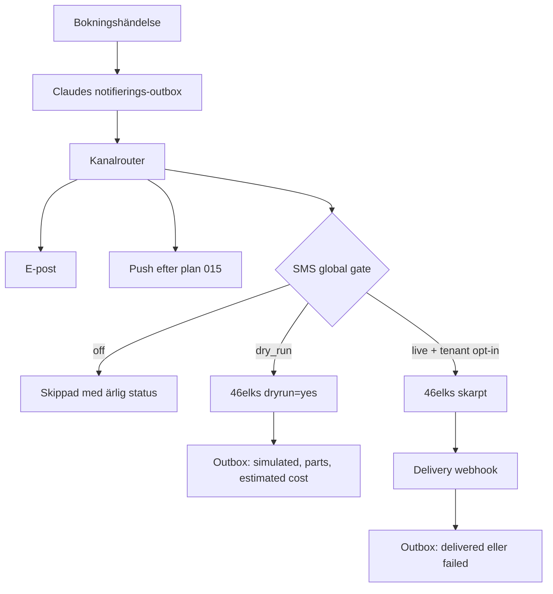
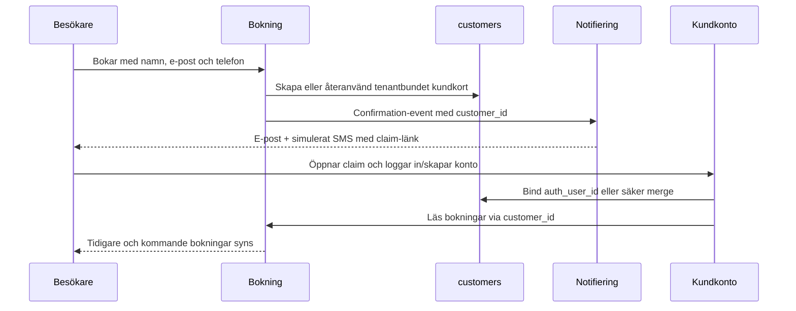

# feat: Lansera första salongens relationspaket

## Goal Capsule

- **Mål:** Första frisörkunden ska kunna driva publik sida, bokning, ägaradmin, personalyta och kundkonto med en sammanhängande kundrelation. Transaktionella SMS ska vara färdigbyggda och verifierade utan skarpa utskick tills Zivar uttryckligen godkänner ett enda live-canary.
- **Lanseringspaket:** Publik sajt, bokning, kalender, kundkort, personalinloggning, kundkonto, konto-claim, bekräftelse/påminnelse/ombokning/avbokning, e-post, SMS-räls, drift och återställning.
- **Styrande beslut:** Betalning vid bokning, webshop, POS, marknadsförings-SMS och global `Mina företag`-hub ingår inte. Betalning sker på plats.
- **Parallellt arbete:** Claude bygger plan 012, 014 och 015. Ingen implementation i denna plan får börja i deras filer innan arbetet är landat och granskat. Planen konsumerar deras outbox-, routing- och push-kontrakt; den skapar inte parallella varianter.
- **Skarp SMS-spärr:** Inga riktiga SMS får skickas före ett uttryckligt beslut från Zivar. Teststegen använder mockad transport och 46elks `dryrun=yes`.
- **Ärlig säkerhetsnivå:** All egen kod och hela provider-kontraktet kan bevisas utan leverans, men faktisk mobiloperatörsleverans kan inte kallas 100 % verifierad före canaryt. Canaryt är därför ett bevissteg, inte ett vanligt test som får loopas.
- **Stopvillkor:** Stoppa vid migrationsnummerkrock, oklart Claude-slutläge, cross-tenant-identitetsmatch, möjlighet till skarpt SMS i defaultläge, eller om ett claim-flöde kan koppla fel persons kundkort.

---

## Product Contract

### Problem Frame

Corevos bokningsmotor, kundkort, personalyta och kundportal finns redan, men de bildar ännu inte en komplett relationskedja. Gästbokningen skapar ett tenantbundet kundkort medan kundportalen fortfarande huvudsakligen läser bokningar via det äldre `bookings.customer_profile_id`. En kund som skapar konto efter sin första gästbokning kan därför sakna sin tidigare bokning och historik. SMS-transporten till 46elks är implementerad men produktionshemligheter saknas, FreshCut har SMS och kundkonton avstängda, och SMS-täckningen är inte komplett för alla bokningshändelser.

Första lanseringen ska inte vara en nedbantad demo. Den ska vara ett smalt men helt verksamhetsflöde: kunden bokar, får besked, kan skapa ett säkert konto, frisören ser samma person och deras historik, personalen arbetar i sin egen vy och Corevo kan se om notifieringar lyckades.

### Actors

- A1. Besökare utan konto som bokar på salongens publika sida.
- A2. Kund med kopplat konto som ser och hanterar egna bokningar.
- A3. Personal som ser sitt schema, hanterar egna bokningar och minns kundens relevanta preferenser.
- A4. Salongsägare som administrerar tjänster, personal, schema, kunder och bokningar.
- A5. Corevo-operatör som aktiverar tenant, notifieringskanaler och driftgrindar.

### Requirements

#### Bokning och relation

- R1. En besökare ska kunna boka en aktiv tjänst hos bokningsbar personal utan konto och utan onlinebetalning.
- R2. Varje bokning ska länkas till ett stabilt tenantbundet `customers.id`; samma verifierade person ska återanvända samma kundkort.
- R3. Frisörens kundkort ska samla besökshistorik, anteckningar, preferenser, allergier, produkter och återbokningskontext utan att exponera en annan tenants data.
- R4. Kundkontot ska visa både tidigare gästbokningar som säkert claimats och senare inloggade bokningar.
- R5. Kunden ska kunna avboka och omboka enligt tenantens tidsgräns, och frisören ska omedelbart se förändringen.

#### SMS och notifieringar

- R6. Transaktionella SMS ska täcka ny bokning, påminnelse, ombokning och avbokning oavsett om händelsen startas av besökaren, kunden, ägaren eller personalen när mottagaren har ett telefonnummer och tenantens kanal är aktiverad.
- R7. Bokningsbekräftelsen ska innehålla en kort, tenantkorrekt hanterings- eller konto-claim-länk som inte är död.
- R8. Varje notifieringsförsök ska ha en idempotent outbox-/leveransrad med event, tenant, kanal, status, provider-id, antal SMS-delar och kostnad eller beräknad kostnad utan att lagra mer PII än nödvändigt.
- R9. SMS ska falla tillbaka enligt den kanalrouting som Claude bygger i plan 014. Ett SMS-fel får aldrig skapa en falskt misslyckad eller dubbel bokning.
- R10. Transportens defaultläge ska vara `off`. `dry_run` får anropa 46elks med `dryrun=yes` men får aldrig leverera till telefon. `live` kräver global driftgrind, tenantopt-in och giltiga credentials.
- R11. Endast transaktionella SMS ingår. Kampanjer, automatiska säljutskick och STOPP-hantering är utanför första lanseringen.

#### Kundkonto och inloggning

- R12. Konto-claim ska vara tenantbundet, tidsbegränsat, engångsbruk och verifierat via en opak länk vars råtoken inte lagras i databasen.
- R13. En claim får bara koppla ett okopplat kundkort eller säkert slå ihop två kort som bevisligen tillhör samma auth-användare. Telefon eller e-post som ensam svag signal får aldrig auto-merga två personer.
- R14. Kunden ska kunna skapa konto från bekräftelselänken, logga in, återställa lösenord, ändra namn/telefon, exportera data och radera konto.
- R15. Öppen registrering utan claim ska antingen verifiera e-post eller vara avstängd för första lanseringen; dagens service-role-skapade, auto-bekräftade konto får inte vara en identitetsgenväg.

#### Personal och ägare

- R16. Ägaren ska kunna bjuda in personal med eget konto och koppla kontot till exakt en befintlig eller ny personalrad.
- R17. Personalens primära inbjudnings- och inloggningsdörr ska vara `booking.corevo.se`; `minbooking.corevo.se` ska fortsätta fungera som legacy-alias tills Zivar beslutar annat.
- R18. Personal utan utökad behörighet ska bara se sin kalender. Delegerad behörighet ska kunna ge tillgång till fler kalendrar utan att ge ägarbehörighet.
- R19. Personal ska kunna se kundens relationskontext, registrera walk-in, markera genomfört/no-show, omboka och avboka egna bokningar inom serverns behörighetsgränser.

#### Drift och lansering

- R20. CI ska vara grön för lint, typkontroll, unit-/kontraktstester, fresh-database-migrationer, RLS/pgTAP och kritisk E2E innan första kundlanseringen.
- R21. Boknings-, konto-, personal- och notifieringsflöden ska provas med ägare, personal, gäst och kund i två tenantkontexter.
- R22. Produktion ska ha verifierad backup/återställningsväg, cronstatus, notifieringsövervakning och ett per-tenant launchkort.
- R23. Det enda planerade skarpa SMS-testet ska vara ett operatörsgatat canary till ett uttryckligen godkänt nummer. Godkänt resultat kräver providerstatus `delivered`, matchande outboxrad och mottagarens bekräftelse.
- R24. Designlikhet räknas inte i denna plans procent. En del är funktionellt klar först när dess data-, behörighets-, fel- och återställningsflöde är bevisat.
- R25. Ett misslyckat eller oklart canary får aldrig retryas automatiskt. FreshCut och global SMS-live förblir avstängda tills felet är förklarat och Zivar uttryckligen godkänner ett nytt försök.

### Key Flows

- F1. Gästbokning och relationsstart
  - **Trigger:** A1 bokar från salongens sida.
  - **Steps:** Tillgänglighet kontrolleras; bokning och kundkort skapas atomiskt; e-post/outbox skapas; SMS simuleras; bekräftelsen innehåller hantering och claim.
  - **Outcome:** Bokningen finns en gång, tiden är låst och samma kundsubjekt används i admin.
  - **Covered by:** R1-R3, R6-R10.

- F2. Claim och kundkonto
  - **Trigger:** A1 öppnar claim-länken från bokningsbekräftelsen.
  - **Steps:** Token verifieras och förbrukas; kunden loggar in eller skapar konto; kundkortet binds eller mergas; portalens ägarskap går via `customers.auth_user_id` och `bookings.customer_id`.
  - **Outcome:** A2 ser den ursprungliga gästbokningen, historiken och samma frisörrelation.
  - **Covered by:** R2-R5, R12-R15.

- F3. Återbesök
  - **Trigger:** A2 öppnar Mina sidor eller A3 öppnar kundkortet vid ett senare besök.
  - **Steps:** Tidigare tjänster, personal, favoriter och relevanta interna preferenser laddas tenantbundet; kunden återbokar eller frisören använder kontexten.
  - **Outcome:** Kunden upplever att salongen minns dem utan att PII visas utanför rätt operativt fönster.
  - **Covered by:** R3-R5, R13, R19.

- F4. Personalens arbetsdag
  - **Trigger:** A3 accepterar inbjudan och loggar in på `booking.corevo.se`.
  - **Steps:** Konto binds till personalrad; behörighet och plats kontrolleras; kalendern uppdateras i realtid; operativa handlingar går genom servervakter.
  - **Outcome:** Personalen kan arbeta utan delad ägarinloggning.
  - **Covered by:** R16-R19.

- F5. SMS dry-run
  - **Trigger:** En notifieringshändelse sker medan globalt läge är `dry_run`.
  - **Steps:** Routing, E.164, avsändare, text, claim-länk och idempotens körs; 46elks får `dryrun=yes` och `dontlog=message`; svaret sparas som simulerat med delar och beräknad kostnad.
  - **Outcome:** Hela produktionsnära flödet bevisas utan levererat SMS eller SMS-kostnad.
  - **Covered by:** R6-R11, R23.

- F6. Ett skarpt canary
  - **Trigger:** Zivar godkänner skarpt test efter att alla andra grindar är gröna.
  - **Steps:** Endast allowlistat nummer tillåts; ett SMS skickas med delivery webhook; status går `created`/`sent` till `delivered` eller `failed`; systemet stängs åter eller öppnas för piloten enligt Zivars beslut.
  - **Outcome:** En enda skarp kostnad ger bevis på hela leveranskedjan.
  - **Covered by:** R8-R10, R23, R25.

### Scope Boundaries

#### Deferred to Follow-Up Work

- Onlinebetalning och Stripe vid bokning.
- Webshop, POS/kassa, klippkortsköp och tenantfakturering.
- Marknadsförings-SMS, kampanjer, tvåvägs-SMS och STOPP-flöde.
- Global `Mina företag`-hub och produktbeslut om global kundidentitet. Första lanseringen behåller en global auth-användare men tenantbundna kundrelationer.
- Full SMS-kostnadsvidarefakturering; första piloten mäter kostnaden men faktureras manuellt enligt separat beslut.
- Visuell acceptans av paket 05 Kundportal. Denna plan verifierar funktion, inte designkanon.

---

## Planning Contract

### Key Technical Decisions

- KTD1. 46elks behålls som provider. Den befintliga Basic Auth- och form-urlencoded-transporten återanvänds; ingen ny SMS-leverantör introduceras.
- KTD2. SMS får tre globala lägen: `off`, `dry_run` och `live`. Default och saknad konfiguration betyder `off`. `live` kräver dessutom tenantens `sms_enabled=true` och credentials. Detta är session-settled: user-directed — valt framför att aktivera SMS direkt, eftersom hela kedjan ska verifieras utan onödiga utskick.
- KTD3. 46elks riktiga `dryrun=yes` används efter mocktester. Det verifierar API-kontrakt, kodning, antal delar och beräknad kostnad utan att leverera ett SMS.
- KTD4. Claudes plan 014-outbox blir enda sanningskälla för kanalval och leveransstatus. Ingen parallell SMS-logg får skapas.
- KTD5. `customers.id` är den stabila tenantrelationen; `customers.auth_user_id` binder den till inloggningen. Kundportalens bokningsläsningar och mutationer flyttas från ensidigt beroende av `customer_profile_id` till det redan RLS-stödda `customer_id`-bandet.
- KTD6. Claim-token lagras hashad med `expires_at` och `used_at`. Den råa token som skickas i länken är ett bearer-bevis och får inte finnas i loggar eller databaskolumner.
- KTD7. Claim via SMS bevisar kontroll över bokningens telefonkanal. Kontots identitet får bara bindas till det tenantbundna kundkort som token skapades för; generell telefonmatchning får enbart föreslå manuell merge.
- KTD8. `booking.corevo.se` är primär personaldörr. Invite-redirect flyttas dit, medan `minbooking.corevo.se` behålls som host-only legacy-dörr med samma serverkontroller.
- KTD9. Betalning på plats är den enda lanserade betalningsformen i denna fas. Betalningskod får inte tas bort, men betalningsgaten hålls av.
- KTD10. Transaktionella notifieringar får aldrig avgöra om bokningen lyckades. Outboxen rapporterar och retryar notifieringen separat från den redan committade bokningen.

### High-Level Technical Design

### Sequencing

1. Vänta in och granska Claudes 012/014/015.
2. Lås identitet och konto-claim innan claim-länk läggs i SMS.
3. Lägg dry-run/live-gaten ovanpå den landade outboxen.
4. Koppla alla transaktionella bokningshändelser till samma router.
5. Slutför personalens primära login/invite och kundportalens ägarskap.
6. Kör hela simuleringen, produktionens dry-run och därefter exakt ett godkänt live-canary.

### Current Functional Baseline

| Del | Funktionellt nuläge | Hindrar 100 % |
|---|---:|---|
| Publik sajt och gästbokning | 93 % | Paus/off måste server- och DB-fencas; sista roll-/tenant-E2E saknas. |
| Kalender och ägaradmin | 88 % | Full notifieringsparitet för adminskapad/flyttad/avbokad bokning och grön CI saknas. |
| Kundkort och relationsdata | 88 % | Gästkort och auth-konto kopplas inte säkert ihop; duplikat/merge är ofärdigt. |
| Personalens funktion | 85 % kodmässigt | FreshCut har fyra aktiva personalrader men noll kopplade personalinloggningar; invite landar på legacy-dörren. |
| Kundkonto | 62 % | Portal finns, men gamla gästbokningar claimas inte; öppen registrering auto-bekräftar e-post. FreshCut har kundkonton av. |
| SMS-transport | 65 % | Kod och tester finns, men Worker saknar 46elks-secrets, FreshCut har SMS av, ingen dry-run/live-gate, ingen delivery webhook och ofullständig händelsetäckning. |
| Notifieringsdurabilitet | Beroende på Claude | Plan 012/014/015 pågår och måste granskas innan ny kod byggs. |
| Drift och releasebevis | 82 % | CI är röd på lint och fresh-database-migration; full roll-/mobil-/notifierings-E2E och restore-bevis saknas. |

Samlad funktionell bedömning för exakt första-kund-paketet före Claudes pågående arbete: cirka 76 %. Procentsatsen räknar inte design, webshop, POS eller onlinebetalning.

---

## Implementation Units

### U1. Integrera Claudes plan 012, 014 och 015 utan parallella kontrakt

- **Goal:** Fastställa det verkliga post-Claude-nuläget och göra deras outbox/routing/push till enda bas för resten av planen.
- **Requirements:** R8-R10, R20-R21; KTD4, KTD10.
- **Dependencies:** Claude måste ha slutlevererat 012/014/015.
- **Files:**
  - `plans/012-durabel-infra-pgcron-webhooks.md`
  - `plans/014-samtycke-kanalrouting-outbox.md`
  - `plans/015-push-pwa.md`
  - `plans/README.md`
  - `5-Kod/apps/web/lib/notifications/`
  - `5-Kod/supabase/migrations/`
  - `5-Kod/supabase/tests/`
- **Approach:** Inspektera deras diff, migrationer, statusmaskin, idempotensnyckel, retryägarskap och GDPR-rensning. Återanvänd namnen och typerna som faktiskt landat. Om en plan bara är delvis byggd ska roadmapen justeras före implementation; skapa aldrig `sms_log` eller en andra outbox.
- **Patterns to follow:** `5-Kod/apps/web/lib/notifications/reminders.ts` lease/CAS-kontrakt och migration 0088:s `FOR UPDATE SKIP LOCKED`.
- **Test scenarios:**
  1. Samma event-id försöker routas två gånger och ger exakt en aktiv leverans per kanal.
  2. Ett transient transportfel lämnar en retrybar rad utan att ändra bokningens status.
  3. GDPR-erase scrubbar kontaktinnehåll men behåller tillåten icke-PII-driftstatistik.
  4. Tenant A kan inte läsa eller uppdatera tenant B:s outboxrader.
- **Verification:** Det finns exakt en routing-/outboxmodell, alla landade migrationer är ordnade och deras tester passerar på en tom databas.

### U2. Bygg säker gäst-till-konto-claim och merge

- **Goal:** Göra kundkortet till samma relation före och efter att kunden skapar konto.
- **Requirements:** R2-R5, R12-R15; F2-F3; KTD5-KTD7.
- **Dependencies:** U1 för att claim-event och notifieringslänk ska använda rätt outboxkontrakt.
- **Files:**
  - `plans/013-identitet-konto-koppling.md`
  - `5-Kod/supabase/migrations/<nästa-lediga>_customer_account_claim.sql`
  - `5-Kod/supabase/tests/customer_account_claim_test.sql`
  - `5-Kod/apps/web/app/(kund)/konto/koppla/[token]/page.tsx`
  - `5-Kod/apps/web/lib/kund/customer.ts`
  - `5-Kod/apps/web/lib/kund/bookings.ts`
  - `5-Kod/apps/web/lib/kund/actions.ts`
  - `5-Kod/apps/web/app/(kund)/registrera/page.tsx`
  - `5-Kod/apps/web/components/kund/SignUpForm.tsx`
  - `5-Kod/apps/web/lib/kund/customer-account-claim.test.ts`
  - `5-Kod/apps/web/lib/kund/customer-booking-write.contract.test.ts`
  - `5-Kod/apps/web/lib/gdpr/erase.ts`
- **Approach:** Ersätt plan 013:s råa, permanent lagrade `claim_token` med en hashad tokenpost med tenant, customer, expiry, used-at och purpose. Claim-RPC:n ska kontrollera auth, tenant, expiry och single-use inuti en transaktion. Om ett authbundet kundkort redan finns får en merge bara ske efter starkt bevis; bokningar och relationsrader flyttas transaktionellt, medan det gamla kortet anonymiseras. Kundportalens läsningar och mutationsfences använder det claimade `customer_id`-bandet som redan stöds av senaste RLS.
- **Execution note:** Börja med DB-/RLS-karakterisering och negativa claimtester innan mergekoden skrivs.
- **Patterns to follow:** `private.protect_customer_auth_binding`, senaste `bookings_location_read`-policyn och befintliga GDPR-erase.
- **Test scenarios:**
  1. Giltig, oanvänd token binder ett okopplat kundkort till inloggad kund inom samma tenant.
  2. Claim gör den ursprungliga gästbokningen synlig i `/konto` och möjlig att avboka/omboka.
  3. Utgången, använd, manipulerad eller annan tenants token nekas utan sidoeffekt.
  4. Token för ett kort kopplat till en annan auth-användare nekas.
  5. Två samtidiga claim-försök ger exakt en vinnare.
  6. Säker merge bevarar bokningar, favoriter, lojalitet och kundanteckningar samt anonymiserar dubbletten.
  7. Samma telefon med annan e-post skapar ingen automatisk cross-person-merge.
  8. GDPR-radering når claimposter och alla mergade PII-band.
- **Verification:** En ny gäst kan boka, claima, logga ut/in och fortfarande se exakt samma bokning och kundrelation; ett negativt cross-tenant-test visar noll läckta rader.

### U3. Lägg en fysisk off/dry-run/live-grind runt 46elks

- **Goal:** Göra det tekniskt omöjligt att skicka skarpt före Zivars beslut och samtidigt verifiera det riktiga provider-kontraktet.
- **Requirements:** R8-R11, R23; F5-F6; KTD1-KTD4.
- **Dependencies:** U1:s outboxkontrakt.
- **Files:**
  - `5-Kod/apps/web/lib/notifications/sms.ts`
  - `5-Kod/apps/web/lib/notifications/sms.test.ts`
  - `5-Kod/apps/web/lib/notifications/settings.ts`
  - `5-Kod/apps/web/app/api/webhooks/46elks/delivery/route.ts`
  - `5-Kod/apps/web/app/api/webhooks/46elks/delivery/route.test.ts`
  - `5-Kod/apps/web/wrangler.jsonc`
  - `5-Kod/docs/ops/sms-activation.md`
  - U1:s faktiska outboxmigration och typfiler
- **Approach:** Lägg ett globalt `SMS_DELIVERY_MODE` med explicit parser och default `off`. I `dry_run` skickar transporten `dryrun=yes` och `dontlog=message`, sparar provider-id, `parts` och `estimated_cost`, men klassar resultatet som `simulated`. I `live` skickas `whendelivered` till en webhook som uppdaterar outbox på provider-id. Webhooken tillåter bara dokumenterade 46elks-källor genom Cloudflare/IP-regel och validerar payload/status; återspelning är idempotent. Lägg en separat canary-allowlist så första liveprovet inte kan skicka till en kundlista.
- **Execution note:** Testa hela statusmaskinen med mockad fetch innan credentials används. Provider-dry-run sker först därefter.
- **Patterns to follow:** Befintlig typad `SmsResult`, PII-sanerad loggning och Claudes outboxstatusmaskin.
- **Test scenarios:**
  1. Saknat/okänt läge beter sig som `off` och gör noll fetch-anrop.
  2. `dry_run` skickar exakt `dryrun=yes`, `dontlog=message`, rätt Basic Auth, E.164, sender-id och URL-kodad text.
  3. `dry_run` kan aldrig producera status `sent` eller `delivered`; outbox blir `simulated` med delar och beräknad kostnad.
  4. `live` utan tenantopt-in eller credentials gör noll provideranrop.
  5. Icke-2xx, timeout och ogiltigt providersvar lämnar ärlig retrybar/failed status utan kast in i bokningen.
  6. Webhookstatus `delivered` och `failed` uppdaterar rätt provider-id idempotent.
  7. Okänd källa, okänt provider-id, ogiltig status och cross-tenant-gissning nekas.
  8. Loggar och fel innehåller varken telefonnummer, token, meddelandetext eller credentials.
- **Verification:** En riktig 46elks-dry-run når API:t och ger `parts`/`estimated_cost`, medan telefonen inte får något. Nätverks- och DB-bevis visar att skarp gren är onåbar utan tre gates.

### U4. Ge alla bokningshändelser samma notifieringskontrakt

- **Goal:** Kunden ska få konsekvent besked oavsett vilken yta som skapade eller ändrade bokningen.
- **Requirements:** R6-R10; F1, F4-F6; KTD4, KTD10.
- **Dependencies:** U1-U3.
- **Files:**
  - `5-Kod/apps/web/lib/notifications/booking.ts`
  - `5-Kod/apps/web/lib/notifications/reminders.ts`
  - `5-Kod/apps/web/app/boka/actions.ts`
  - `5-Kod/apps/web/app/avboka/actions.ts`
  - `5-Kod/apps/web/lib/kund/actions.ts`
  - `5-Kod/apps/web/lib/admin/calendar-actions.ts`
  - `5-Kod/apps/web/lib/personal/actions.ts`
  - `5-Kod/apps/web/components/admin/NewBookingDrawer.tsx`
  - `5-Kod/apps/web/lib/notifications/booking.test.ts`
  - `5-Kod/apps/web/lib/notifications/reminders.test.ts`
  - `5-Kod/apps/web/lib/notifications/booking-channel-coverage.contract.test.ts`
- **Approach:** Alla call-sites emitterar domänhändelser till samma router i stället för egna direktsändningar. Bekräftelse, ombokning och avbokning får korta SMS-mallar med tenantnamn, rätt tid/tidszon och säker hanterings-/claim-länk när relevant. Adminens `Skicka inget/e-post` utökas sanningsenligt till tillgängliga kanaler efter routing; personalåtgärder hämtar kontakt genom befintlig vaktad kontaktväg och notifierar utan rå PII i kalenderpayloaden.
- **Patterns to follow:** `create_admin_booking` idempotensresultat, `get_customer_contact`, reminder-lease och befintliga e-postmallar.
- **Test scenarios:**
  1. Publik nybokning skapar exakt en confirmation-händelse och en giltig claim-/hanteringslänk.
  2. Adminskapad bokning med SMS/båda och telefon skickar/simulerar vald kanal; `Skicka inget` ger ingen outboxrad.
  3. Kundkonto-ombokning skapar exakt en ombokningsnotis för den nya tiden.
  4. Gäst-, kund-, personal- och ägaravbokning skapar rätt avbokningsnotis och `cancelled_by`.
  5. Påminnelse fungerar för e-post+telefon, endast telefon och endast e-post utan att återclaima redan levererad rad.
  6. Dubbel submit eller retry ger inte dubbla kundnotiser.
  7. Saknad kontakt eller avstängd kanal visas som ärligt `skipped`, aldrig som skickad.
  8. Ett notifieringsfel lämnar bokningen skapad/ändrad exakt en gång.
- **Verification:** Eventmatrisen nybokning/påminnelse/ombokning/avbokning × gäst/kund/admin/personal har ett automatiskt bevis och samma outboxkontrakt.

### U5. Slutför kund- och personalinloggning för piloten

- **Goal:** Varje användartyp ska nå rätt yta med eget konto och korrekt tenant-/rollfence.
- **Requirements:** R12-R19, R21; F2-F4; KTD5-KTD8.
- **Dependencies:** U2 för kundclaim och U1 för push/channel state.
- **Files:**
  - `5-Kod/apps/web/lib/auth/invite.ts`
  - `5-Kod/apps/web/lib/auth/roles.ts`
  - `5-Kod/apps/web/lib/auth/host-routing.ts`
  - `5-Kod/apps/web/app/(auth)/actions.ts`
  - `5-Kod/apps/web/app/(auth)/valkommen/AcceptInviteForm.tsx`
  - `5-Kod/apps/web/lib/admin/actions.ts`
  - `5-Kod/apps/web/app/(personal)/personal/`
  - `5-Kod/apps/web/app/(kund)/konto/`
  - `5-Kod/apps/web/lib/auth/host-routing.test.ts`
  - `5-Kod/apps/web/lib/auth/roles.test.ts`
  - `5-Kod/apps/web/lib/admin/staff-onboarding.contract.test.ts`
  - `5-Kod/e2e/first-customer-roles.spec.ts`
- **Approach:** Staff-invite använder booking-dörrens `/valkommen`; legacy-login på minbooking fortsätter accepteras. Onboarding ska kunna länka befintlig personalrad utan dubblett och rulla tillbaka föräldralösa auth-användare. Kundkonto aktiveras först när U2:s claim är klar. Återställning och `next`-redirect fortsätter använda säkra interna vägar.
- **Test scenarios:**
  1. Ägare loggar in på booking och landar i `/admin`.
  2. Personal accepterar invite på booking, landar i `/personal` och är bunden till rätt staff-rad.
  3. Samma personal kan fortfarande använda minbooking utan att få högre behörighet.
  4. Personal utan `can_view_all_calendars` ser bara egna bokningar; delegerad personal ser tillåtna kalendrar.
  5. Inaktiv personal nekas även med gammal JWT/session.
  6. Kund claimar konto på tenant-host, loggar ut/in och kan återställa lösenord utan att hamna på backoffice-host.
  7. Konto från tenant A ger ingen åtkomst till tenant B:s kundkort, bokningar eller personalyta.
  8. Misslyckad invite lämnar ingen auth-user, `public.users`-rad eller staff-binding i halvt tillstånd.
- **Verification:** Fyra rollkonton kan användas parallellt i separata flikar/host-only cookies med förväntad landning och noll cross-role-läckage.

### U6. Bevisa relationsupplevelsen utan designbedömning

- **Goal:** Verifiera att funktionerna faktiskt hjälper salongen att känna igen och återbetjäna kunden.
- **Requirements:** R3-R5, R18-R19, R24; F3-F4.
- **Dependencies:** U2, U4-U5.
- **Files:**
  - `5-Kod/apps/web/lib/personal/calendar.ts`
  - `5-Kod/apps/web/lib/personal/customer.ts`
  - `5-Kod/apps/web/components/personal/ClientCard.tsx`
  - `5-Kod/apps/web/components/personal/CustomerNotesForm.tsx`
  - `5-Kod/apps/web/app/(kund)/konto/page.tsx`
  - `5-Kod/apps/web/app/(kund)/konto/bokningar/[id]/page.tsx`
  - `5-Kod/apps/web/lib/personal/customer.test.ts`
  - `5-Kod/apps/web/lib/kund/customer-booking-write.contract.test.ts`
  - `5-Kod/e2e/customer-relationship.spec.ts`
- **Approach:** Behåll den befintliga kundkorts- och portalytan men verifiera datakedjan efter claim: samma `customer_id` ska bära historik, favoritfrisör, vanlig tjänst och personalens interna anteckningar. Kundens egen vy får inte visa interna anteckningar eller tidsbegränsad kontakt-PII.
- **Test scenarios:**
  1. Personal öppnar dagens bokning och ser kundens tillåtna namn samt sparade preferenser.
  2. Personal sparar klipp-/produktpreferens; den finns kvar vid nästa bokning två veckor senare.
  3. Kunden ser tidigare tjänst/favoritfrisör och kan återboka, men ser aldrig intern anteckning.
  4. Kontaktuppgifter visas bara inom den befintliga operativa PII-vakten.
  5. Kundens namn-/integritetsval respekteras i kalender och kundkort.
  6. GDPR-export och radering omfattar claim, kundkort, bokningslänk, outbox och pushprenumeration.
- **Verification:** Ett automatiserat tvåbesöks-scenario visar att frisören får rätt minneskontext och att kunden återser rätt historik utan PII-läckage.

### U7. Gör CI och drift till en verklig lanseringsgrind

- **Goal:** Göra varje framtida ändring säkert releasbar och första kundens drift återställbar.
- **Requirements:** R20-R25.
- **Dependencies:** U1-U6.
- **Files:**
  - `5-Kod/apps/web/app/(public)/integritetspolicy/page.tsx`
  - `5-Kod/supabase/migrations/0004_public_read_and_hardening.sql`
  - `.github/workflows/ci.yml`
  - `.github/workflows/deploy.yml`
  - `.github/workflows/booking-cron.yml`
  - `5-Kod/e2e/first-customer-launch.spec.ts`
  - `5-Kod/docs/ops/sms-activation.md`
  - `5-Kod/docs/ops/first-customer-launch.md`
  - `6-Testing/forsta-kunden-acceptans.md`
- **Approach:** Rätta den nuvarande lintmissen och fresh-database-felet innan fler migrationsberoenden läggs på. Slå på kritisk E2E med isolerade tenantfixtures. Runbooken ska innehålla backup/restore, cronstatus, Worker/Supabase-secrets som namn, notifieringsövervakning, rollback och vem som beslutar om live-SMS.
- **Execution note:** Test- och migrationgrinden ska vara grön innan dry-run görs i produktion.
- **Test scenarios:**
  1. Hela migrationkedjan bygger en tom databas och RLS/pgTAP passerar.
  2. Två tenants seedas; samtliga roller och kundflöden förblir isolerade.
  3. Mobil webbläsare kan skapa, flytta med touch, omboka och avboka relevanta bokningar.
  4. Cronöverlapp ger ingen dubbel påminnelse; pg_cron-rensningar och GitHub-reminderjobbet rapporterar fel.
  5. Worker utan SMS-secrets och defaultkonfig kan aldrig göra live-fetch.
  6. Backup finns och en dokumenterad restore-kontroll kan genomföras utan att gissa.
- **Verification:** CI, deploy-smoke, databastester och E2E är gröna på samma commit som ska lanseras; runbooken kan följas av en annan operatör.

### U8. Onboarda FreshCut i dry-run och genomför ett enda live-canary

- **Goal:** Göra den första tenantens faktiska data och konton lanseringsklara utan oavsiktliga utskick.
- **Requirements:** R16-R25; F4-F6.
- **Dependencies:** U1-U7 och uttryckligt godkännande före live-steget.
- **Files:**
  - `5-Kod/docs/ops/first-customer-launch.md`
  - `6-Testing/forsta-kunden-acceptans.md`
- **Approach:** FreshCut har i verifierat nuläge fyra aktiva personalrader, samtliga med arbetstider/tjänster, men noll kopplade personalinloggningar. `customer_accounts_enabled=false` och `sms_enabled=false`; Worker har inga `SMS_46ELKS_USERNAME`/`SMS_46ELKS_PASSWORD`-secrets. Onboardingen bjuder in personal, provar kundclaim och kör notifieringsmatrisen i `dry_run`. Credentials kan sättas för dry-run, men livegaten förblir stängd. När Zivar säger ja öppnas endast canary-allowlist, ett SMS skickas och delivery webhook måste visa `delivered`. Därefter krävs ett separat ja för att aktivera FreshCut brett.
- **Test scenarios:**
  1. Alla fyra personalrader har ett fungerande personligt konto eller är uttryckligen markerade som ej inloggande.
  2. En gästbokning skapar kundkort, dry-run-bekräftelse och claimbar kundportal.
  3. Ombokning, avbokning och påminnelse ger rätt simulerad status och inga telefoner får SMS.
  4. Ägare, personal och kund kan vara inloggade parallellt utan sessionskrock.
  5. Ett enda allowlistat live-canary går till `delivered`, sparar provider-id/delar/kostnad och bekräftas på mottagartelefonen.
  6. Ett misslyckat canary lämnar FreshCut avstängd och ger en konkret incidentrad, inte en falsk lansering.
  7. Ett misslyckat eller oklart canary skapar inget automatiskt retryförsök; ett nytt försök kräver ett nytt uttryckligt godkännande.
- **Verification:** Checklistan är signerad med dry-run-bevis för hela matrisen och, först efter Zivars beslut, ett enda levererat canary. Inga riktiga kundnummer har använts i test.

---

## Verification Contract

| Gate | Bevis | Berörda units | Klar när |
|---|---|---|---|
| Kodkvalitet | Repoets lint, typkontroll och fulla testsuite | U1-U7 | Alla går grönt utan exkluderade fel. |
| Databas | Fresh start, migrationslista, pgTAP/RLS och advisors | U1-U3, U7 | Tom DB når senaste migration; inga nya security errors; claim/outbox är tenantisolerade. |
| Notifieringskontrakt | Unit- och kontraktstester med mockad fetch | U3-U4 | Ingen nätverkstrafik; hela eventmatrisen och felfall passerar. |
| Provider-simulering | 46elks `dryrun=yes` + `dontlog=message` | U3, U8 | Provider returnerar delar/beräknad kostnad och ingen telefon får SMS. |
| Kundrelation | Tvåbesöks-E2E med claim | U2, U5-U6 | Samma customer-id bär historik och rätt portal-/personalvy. |
| Roller | Ägare, personal, kund och gäst över två tenants | U5-U8 | Rätt landningar och noll cross-tenant/cross-role-åtkomst. |
| Mobil | Verklig iOS/Android eller touch-emulering plus manuell kontroll | U5-U8 | Kritiska bokningshandlingar fungerar utan mus. |
| Drift | Deploy-smoke, cronstatus, backup-/restore-runbook | U7-U8 | Samma release är observerbar och återställbar. |
| Live-canary | Ett allowlistat SMS + delivery webhook | U8 | Zivar har godkänt; provider/outbox/mottagare visar samma levererade meddelande. |

---

## Definition of Done

- Publik bokning, ägaradmin, personalyta och kundkonto fungerar som ett tenantbundet helhetsflöde utan onlinebetalning.
- En gästbokning kan claimas säkert och syns efter logout/login i kundens konto.
- Frisören ser samma kundkort, historik och relevanta preferenser vid nästa besök; kunden ser aldrig interna anteckningar.
- Personalens booking-invite, login, roll, kalender, schema och kundåtgärder är verifierade med riktiga pilotkonton.
- Alla transaktionella bokningshändelser går genom en enda kanalrouter/outbox och har en idempotent status.
- SMS-transporten är default-off, dry-run-verifierad mot 46elks och tekniskt oförmögen att skicka live utan global gate, tenantopt-in och credentials.
- Leveranswebhook, kostnad/delar och felstatus är byggda före det enda live-canaryt.
- Inget skarpt SMS har skickats utan Zivars uttryckliga beslut; testsviten använder inga riktiga kundnummer.
- CI inklusive fresh-database/RLS/E2E är grön, produktionen är smoke-testad och backup-/restorevägen är dokumenterad.
- FreshCuts per-tenant launchchecklista är godkänd. Betalning, webshop, POS och marknadsförings-SMS är fortsatt avstängda och ärligt markerade som senare arbete.

---

## Appendix

### Verified Inputs on 2026-07-18

- `main` var deployad på migration 0090 före Claudes nya arbete.
- FreshCut var aktiv med fyra aktiva personalrader, fyra med arbetstider och tjänstekoppling, men noll kopplade personalinloggningar.
- FreshCut hade `sms_enabled=false` och `customer_accounts_enabled=false`; bokningsbekräftelse och påminnelse var aktiverade.
- Cloudflare Worker hade e-post-, cron- och Supabase-secrets men saknade `SMS_46ELKS_USERNAME` och `SMS_46ELKS_PASSWORD`.
- Befintlig kod hade 46elks-transport, E.164, sender-id och tester; bokningsbekräftelse, påminnelse och gäst-avbokning nådde SMS, medan kundkonto-/personal-/adminparitet var ofullständig.
- Supabase RLS stödde redan kundägarskap via både `customer_profile_id` och joinen `bookings.customer_id -> customers.auth_user_id`; appens kundbokningsläsningar använde fortfarande enbart legacy-fältet.
- 46elks officiella API stödde `dryrun=yes`, `whendelivered`, `dontlog=message`, `parts`, `estimated_cost`, provider-id och statusarna `created`, `sent`, `failed`, `delivered`.

### Sources & Research

- `plans/006-sms-46elks-integration.md`
- `plans/013-identitet-konto-koppling.md`
- `plans/014-samtycke-kanalrouting-outbox.md`
- `plans/015-push-pwa.md`
- `5-Kod/docs/ops/sms-activation.md`
- `5-Kod/docs/notifications-architecture.md`
- 46elks API: `https://46elks.se/docs/send-sms`
- 46elks callback origin: `https://46elks.se/docs/verify-callback-origin`
