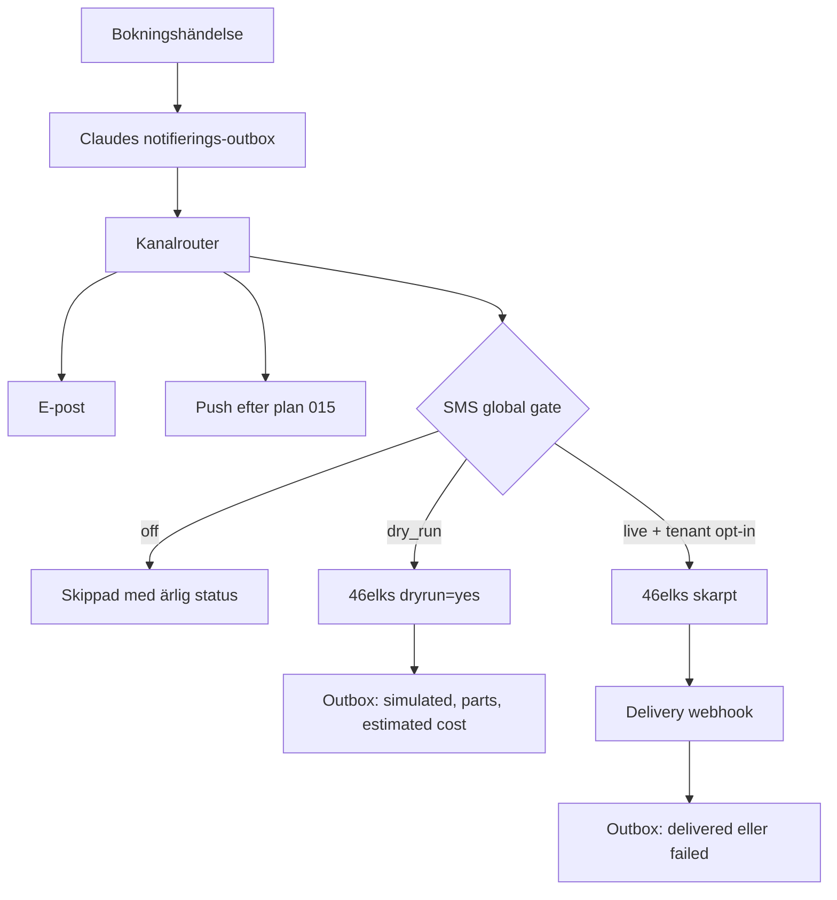
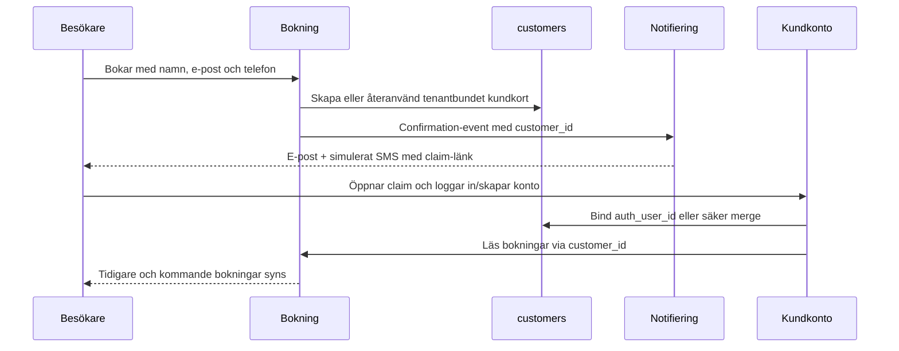

# feat: Lansera första salongens relationspaket

## Goal Capsule

- **Mål:** Första frisörkunden ska kunna driva publik sida, bokning, ägaradmin, personalyta och kundkonto med en sammanhängande kundrelation. Transaktionella SMS ska vara färdigbyggda och verifierade utan skarpa utskick tills Zivar uttryckligen godkänner ett enda live-canary.
- **Lanseringspaket:** Publik sajt, bokning, kalender, kundkort, personalinloggning, kundkonto, konto-claim, bekräftelse/påminnelse/ombokning/avbokning, e-post, SMS-räls, drift och återställning.
- **Styrande beslut:** Betalning vid bokning, webshop, POS, marknadsförings-SMS och global `Mina företag`-hub ingår inte. Betalning sker på plats.
- **Landat parallellarbete:** Claude-arbetet för plan 014 och 015 finns på `main` i `86df682`. Det gav schema för kanalpreferenser/outbox/push och en router. Plan 012 är fortfarande markerad `HALV`: pg_cron-grunden för rena DB-svep landade tidigare, men reminder-scheduling och durable notifieringsdispatch återstår. Auditen visar dessutom att outboxen loggar terminala resultat och saknar en verklig `queued -> attempting -> sent/failed`-dispatcher. Planen härdar det landade kontraktet; den skapar inte en andra outbox.
- **Skarp SMS-spärr:** Inga riktiga SMS får skickas före ett uttryckligt beslut från Zivar. Teststegen använder mockad transport och 46elks `dryrun=yes`.
- **Ärlig säkerhetsnivå:** All egen kod och hela provider-kontraktet kan bevisas utan leverans, men faktisk mobiloperatörsleverans kan inte kallas 100 % verifierad före canaryt. Canaryt är därför ett bevissteg, inte ett vanligt test som får loopas.
- **Stopvillkor:** Stoppa vid migrationsnummerkrock, cross-tenant-identitetsmatch som kräver global identitetsarkitektur, möjlighet till skarpt SMS i defaultläge, om ett claim-flöde kan koppla fel persons kundkort eller om en ändring skulle aktivera betalning/webshop/presentkort för piloten.
- **Truth-audit:** Tre oberoende, skrivskyddade domängranskningar gjordes mot `main@a6798f2`. Ett påstående räknas inte som löst förrän dess X→Y-kedja, negativa fall och synliga UI-besked har automatiskt bevis.

---

## Product Contract

### Problem Frame

Corevos bokningsmotor, kundkort, personalyta och kundportal finns redan, men de bildar ännu inte en komplett relationskedja. Gästbokningen skapar ett tenantbundet kundkort medan kundportalen fortfarande huvudsakligen läser bokningar via det äldre `bookings.customer_profile_id`. En kund som skapar konto efter sin första gästbokning kan därför sakna sin tidigare bokning och historik. SMS-transporten till 46elks är implementerad men produktionshemligheter saknas, FreshCut har SMS och kundkonton avstängda, och SMS-täckningen är inte komplett för alla bokningshändelser.

Första lanseringen ska inte vara en nedbantad demo. Den ska vara ett smalt men helt verksamhetsflöde: kunden bokar, får besked, kan skapa ett säkert konto, frisören ser samma person och deras historik, personalen arbetar i sin egen vy och Corevo kan se om notifieringar lyckades.

### Actors

- A1. Besökare utan konto som bokar på salongens publika sida.
- A2. Kund med kopplat konto som ser och hanterar egna bokningar.
- A3. Personal som ser sitt schema, hanterar egna bokningar och minns kundens relevanta preferenser.
- A4. Salongsägare som administrerar tjänster, personal, schema, kunder och bokningar.
- A5. Corevo-operatör som aktiverar tenant, notifieringskanaler och driftgrindar.

### Requirements

#### Bokning och relation

- R1. En besökare ska kunna boka en aktiv tjänst hos bokningsbar personal utan konto och utan onlinebetalning.
- R2. Varje bokning ska länkas till ett stabilt tenantbundet `customers.id`; samma verifierade person ska återanvända samma kundkort.
- R3. Frisörens kundkort ska samla besökshistorik, anteckningar, preferenser, allergier, produkter och återbokningskontext utan att exponera en annan tenants data.
- R4. Kundkontot ska visa både tidigare gästbokningar som säkert claimats och senare inloggade bokningar.
- R5. Kunden ska kunna avboka och omboka enligt tenantens tidsgräns, och frisören ska omedelbart se förändringen.

#### SMS och notifieringar

- R6. Transaktionella SMS ska täcka ny bokning, påminnelse, ombokning och avbokning oavsett om händelsen startas av besökaren, kunden, ägaren eller personalen när mottagaren har ett telefonnummer och tenantens kanal är aktiverad.
- R7. Bokningsbekräftelsen ska innehålla en kort, tenantkorrekt hanterings- eller konto-claim-länk som inte är död.
- R8. Varje notifieringsförsök ska ha en idempotent outbox-/leveransrad med event, tenant, kanal, status, provider-id, antal SMS-delar och kostnad eller beräknad kostnad utan att lagra mer PII än nödvändigt.
- R9. SMS ska falla tillbaka enligt den kanalrouting som Claude bygger i plan 014. Ett SMS-fel får aldrig skapa en falskt misslyckad eller dubbel bokning.
- R10. Transportens defaultläge ska vara `off`. `dry_run` får anropa 46elks med `dryrun=yes` men får aldrig leverera till telefon. `live` kräver global driftgrind, tenantopt-in och giltiga credentials.
- R11. Endast transaktionella SMS ingår. Kampanjer, automatiska säljutskick och STOPP-hantering är utanför första lanseringen.

#### Kundkonto och inloggning

- R12. Konto-claim ska vara tenantbundet, tidsbegränsat, engångsbruk och verifierat via en opak länk vars råtoken inte lagras i databasen.
- R13. En claim får bara koppla ett okopplat kundkort eller säkert slå ihop två kort som bevisligen tillhör samma auth-användare. Telefon eller e-post som ensam svag signal får aldrig auto-merga två personer.
- R14. Kunden ska kunna skapa konto från bekräftelselänken, logga in, återställa lösenord, ändra namn/telefon, exportera data och radera konto.
- R15. Öppen registrering utan claim ska antingen verifiera e-post eller vara avstängd för första lanseringen; dagens service-role-skapade, auto-bekräftade konto får inte vara en identitetsgenväg.

#### Personal och ägare

- R16. Ägaren ska kunna bjuda in personal med eget konto och koppla kontot till exakt en befintlig eller ny personalrad.
- R17. Personalens primära inbjudnings- och inloggningsdörr ska vara `booking.corevo.se`; `minbooking.corevo.se` ska fortsätta fungera som legacy-alias tills Zivar beslutar annat.
- R18. Personal utan utökad behörighet ska bara se sin kalender. Delegerad behörighet ska kunna ge tillgång till fler kalendrar utan att ge ägarbehörighet.
- R19. Personal ska kunna se kundens relationskontext, registrera walk-in, markera genomfört/no-show, omboka och avboka egna bokningar inom serverns behörighetsgränser.

#### Drift och lansering

- R20. CI ska vara grön för lint, typkontroll, unit-/kontraktstester, fresh-database-migrationer, RLS/pgTAP och kritisk E2E innan första kundlanseringen.
- R21. Boknings-, konto-, personal- och notifieringsflöden ska provas med ägare, personal, gäst och kund i två tenantkontexter.
- R22. Produktion ska ha verifierad backup/återställningsväg, cronstatus, notifieringsövervakning och ett per-tenant launchkort.
- R23. Det enda planerade skarpa SMS-testet ska vara ett operatörsgatat canary till ett uttryckligen godkänt nummer. Godkänt resultat kräver providerstatus `delivered`, matchande outboxrad och mottagarens bekräftelse.
- R24. Designlikhet räknas inte i denna plans procent. En del är funktionellt klar först när dess data-, behörighets-, fel- och återställningsflöde är bevisat.
- R25. Ett misslyckat eller oklart canary får aldrig retryas automatiskt. FreshCut och global SMS-live förblir avstängda tills felet är förklarat och Zivar uttryckligen godkänner ett nytt försök.
- R26. En passerad bokning får inte automatiskt antas vara genomförd. Efter `end_ts` ska den ligga i en tydlig avslutningskö tills ägare/personal markerar `completed` eller `no_show`; båda valen ska vara omöjliga före `end_ts`.
- R27. Besök, spenderat, stammis, retention och realiserad omsättning ska enbart bygga på genomförda besök. `pending`, `confirmed`, `cancelled` och `no_show` ska visas separat. Om pending/confirmed summeras ekonomiskt ska etiketten vara **bokningsvärde**, inte omsättning.
- R28. Publik bokningsskrivning ska i databasen verifiera att starttiden är en start som motorn faktiskt skulle erbjuda just nu: minsta framförhållning, maxhorisont, slotsteg/explicit start, schema, frånvaro, plats, tjänst, personal och krock. Att appen använder service-role får aldrig ge publik trafik adminundantag.
- R29. Kundens namn, e-post och telefon får inte lagras i `bookings.note`. Bokningens note ska endast innehålla kundens verkliga meddelande; kontakt ska hämtas tenantbundet från kundrelationen och genom befintligt operativt PII-fönster.
- R30. UI får bara lova en följdeffekt som har en verifierad status. `queued`, `sent`, `failed`, `skipped` och `simulated` ska skiljas åt; exempelvis får en sparad bokning inte automatiskt bli ”bekräftelse skickad”.
- R31. Tills ett separat beslut om global kundidentitet/Mina företag fattas ska kundportalen faila stängt om aktuell host-tenant inte matchar kontots tenant. Tenant B:s varumärke får aldrig rama in tenant A:s kontodata.
- R32. Varje publik modul-länk ska gatas med samma modul-/datavillkor som målrouten. Avstängda eller tomma moduler får inte länkas från ett tema till en 404, och den kanoniska klubbvägen är `/klubb`, inte `/stamkund`.
- R33. GDPR-radering av en kund ska vara en tenant-fencad databastransaktion. Antingen anonymiseras/scrubbas/auditloggas allt, eller så rullas allt tillbaka.
- R34. En tjänst får inte beskrivas som bokningsbar förrän minst en aktiv, synlig och schemalagd personalrelation kan erbjuda en tid. Foto-, kart-, säkerhets- och auditbesked ska på samma sätt beskriva verkligt tillstånd.
- R35. Betalnings-, webshop- och presentkortsmoduler som inte ingår i piloten ska förbli avstängda. De får inte lanseras förrän presentkort aktiveras först efter verifierad betalning, `awaiting_payment`-reservationer sveps och betalningsombokning är atomisk.
- R36. Tidskritiska påminnelser ska ha en primär, varaktig scheduler som inte kan tystna på grund av GitHub Actions-inaktivitet eller oregelbundet intervall. Under övergången ska gammal och ny trigger kunna överlappa utan dubbla notifieringar, med heartbeat och larm på utebliven eller felaktig körning.

### Key Flows

- F1. Gästbokning och relationsstart
  - **Trigger:** A1 bokar från salongens sida.
  - **Steps:** Tillgänglighet kontrolleras; bokning och kundkort skapas atomiskt; e-post/outbox skapas; SMS simuleras; bekräftelsen innehåller hantering och claim.
  - **Outcome:** Bokningen finns en gång, tiden är låst och samma kundsubjekt används i admin.
  - **Covered by:** R1-R3, R6-R10.

- F2. Claim och kundkonto
  - **Trigger:** A1 öppnar claim-länken från bokningsbekräftelsen.
  - **Steps:** Token verifieras och förbrukas; kunden loggar in eller skapar konto; kundkortet binds eller mergas; portalens ägarskap går via `customers.auth_user_id` och `bookings.customer_id`.
  - **Outcome:** A2 ser den ursprungliga gästbokningen, historiken och samma frisörrelation.
  - **Covered by:** R2-R5, R12-R15.

- F3. Återbesök
  - **Trigger:** A2 öppnar Mina sidor eller A3 öppnar kundkortet vid ett senare besök.
  - **Steps:** Tidigare tjänster, personal, favoriter och relevanta interna preferenser laddas tenantbundet; kunden återbokar eller frisören använder kontexten.
  - **Outcome:** Kunden upplever att salongen minns dem utan att PII visas utanför rätt operativt fönster.
  - **Covered by:** R3-R5, R13, R19.

- F4. Personalens arbetsdag
  - **Trigger:** A3 accepterar inbjudan och loggar in på `booking.corevo.se`.
  - **Steps:** Konto binds till personalrad; behörighet och plats kontrolleras; kalendern uppdateras i realtid; operativa handlingar går genom servervakter.
  - **Outcome:** Personalen kan arbeta utan delad ägarinloggning.
  - **Covered by:** R16-R19.

- F5. SMS dry-run
  - **Trigger:** En notifieringshändelse sker medan globalt läge är `dry_run`.
  - **Steps:** Routing, E.164, avsändare, text, claim-länk och idempotens körs; 46elks får `dryrun=yes` och `dontlog=message`; svaret sparas som simulerat med delar och beräknad kostnad.
  - **Outcome:** Hela produktionsnära flödet bevisas utan levererat SMS eller SMS-kostnad.
  - **Covered by:** R6-R11, R23.

- F6. Ett skarpt canary
  - **Trigger:** Zivar godkänner skarpt test efter att alla andra grindar är gröna.
  - **Steps:** Endast allowlistat nummer tillåts; ett SMS skickas med delivery webhook; status går `created`/`sent` till `delivered` eller `failed`; systemet stängs åter eller öppnas för piloten enligt Zivars beslut.
  - **Outcome:** En enda skarp kostnad ger bevis på hela leveranskedjan.
  - **Covered by:** R8-R10, R23, R25.

- F7. Avsluta ett passerat besök sanningsenligt
  - **Trigger:** `end_ts` har passerat för en bokning i `pending` eller `confirmed`.
  - **Steps:** Bokningen visas i ”Behöver avslutas”; behörig ägare/personal väljer genomförd eller uteblev; server och DB verifierar tenant, roll, `end_ts` och tillåten statusövergång; completion-bundna effekter skapas idempotent.
  - **Outcome:** Historik, lojalitet, recension, statistik och kundrelation bygger på ett explicit verkligt utfall, aldrig på att klockan passerat.
  - **Covered by:** R3, R19, R26-R27.

- F8. Publik bokning med manipulerad tid
  - **Trigger:** En klient postar en tid som inte fanns i det senaste availability-svaret.
  - **Steps:** DB-skrivgränsen räknar om publik eligibility oberoende av service-role; min/max, slotstart, schema, frånvaro och krock kontrolleras i samma transaktion som bokningen.
  - **Outcome:** Endast en fortfarande giltig publik start kan bli bokning; nekad manipulation skapar varken bokning, kundkort eller notifiering.
  - **Covered by:** R1-R2, R21, R28-R29.

- F9. Konto öppnas på fel tenant-host
  - **Trigger:** En inloggad kund för tenant A öppnar `/konto` på tenant B:s host.
  - **Steps:** Serverlayouten jämför resolved host-tenant med den tenant som profilen/kundrelationen är bunden till innan varumärke eller kontodata renderas.
  - **Outcome:** Begäran nekas med neutral, sann instruktion; ingen A-data visas under B:s varumärke. Global tenantväxling byggs inte i denna fas.
  - **Covered by:** R13-R15, R21, R31.

- F10. Sann notifieringsstatus
  - **Trigger:** En bokningshändelse emitterar ett kundbesked.
  - **Steps:** En idempotent rad köas transaktionellt; dispatcher claimar med lease; kanaltransport ger explicit resultat; retry hanterar transient fel; UI visar bokningen som sparad och notifieringen som köad/skickad/misslyckad/skippad/simulerad enligt faktisk status.
  - **Outcome:** Ett kundbesked tappas inte tyst, dubbleras inte vid vanlig retry och beskrivs aldrig som skickat enbart för att bokningen sparades.
  - **Covered by:** R6-R10, R25, R30.

### Scope Boundaries

#### Deferred to Follow-Up Work

- Onlinebetalning och Stripe vid bokning.
- Webshop, POS/kassa, klippkortsköp och tenantfakturering.
- Marknadsförings-SMS, kampanjer, tvåvägs-SMS och STOPP-flöde.
- Global `Mina företag`-hub och produktbeslut om global kundidentitet. Första lanseringen behåller en global auth-användare men tenantbundna kundrelationer.
- Full SMS-kostnadsvidarefakturering; första piloten mäter kostnaden men faktureras manuellt enligt separat beslut.
- Visuell acceptans av paket 05 Kundportal. Denna plan verifierar funktion, inte designkanon.
- Produktbeslut om automatisk avslutning. Piloten använder explicit `completed/no_show`; systemet gissar inte att kunden kom.
- Google Places/Business Profile-synk. Tills en riktig integration byggs tas löftet om automatisk rating bort och inget standardbetyg framställs som verkligt.
- Aktivering av PayPal, Stripe-bokningsbetalning, webshop och digitala presentkort. De verifierade betalningsfynden är releaseblockerare för respektive modul men blockerar inte den betalning-på-plats-pilot där modulerna är avstängda.

---

## Planning Contract

### Key Technical Decisions

- KTD1. 46elks behålls som provider. Den befintliga Basic Auth- och form-urlencoded-transporten återanvänds; ingen ny SMS-leverantör introduceras.
- KTD2. SMS får tre globala lägen: `off`, `dry_run` och `live`. Default och saknad konfiguration betyder `off`. `live` kräver dessutom tenantens `sms_enabled=true` och credentials. Detta är session-settled: user-directed — valt framför att aktivera SMS direkt, eftersom hela kedjan ska verifieras utan onödiga utskick.
- KTD3. 46elks riktiga `dryrun=yes` används efter mocktester. Det verifierar API-kontrakt, kodning, antal delar och beräknad kostnad utan att leverera ett SMS.
- KTD4. Claudes plan 014-outbox blir enda sanningskälla för kanalval och leveransstatus. Ingen parallell SMS-logg får skapas.
- KTD5. `customers.id` är den stabila tenantrelationen; `customers.auth_user_id` binder den till inloggningen. Kundportalens bokningsläsningar och mutationer flyttas från ensidigt beroende av `customer_profile_id` till det redan RLS-stödda `customer_id`-bandet.
- KTD6. Claim-token lagras hashad med `expires_at` och `used_at`. Den råa token som skickas i länken är ett bearer-bevis och får inte finnas i loggar eller databaskolumner.
- KTD7. Claim via SMS bevisar kontroll över bokningens telefonkanal. Kontots identitet får bara bindas till det tenantbundna kundkort som token skapades för; generell telefonmatchning får enbart föreslå manuell merge.
- KTD8. `booking.corevo.se` är primär personaldörr. Invite-redirect flyttas dit, medan `minbooking.corevo.se` behålls som host-only legacy-dörr med samma serverkontroller.
- KTD9. Betalning på plats är den enda lanserade betalningsformen i denna fas. Betalningskod får inte tas bort, men betalningsgaten hålls av.
- KTD10. Transaktionella notifieringar får aldrig avgöra om bokningen lyckades. Outboxen rapporterar och retryar notifieringen separat från den redan committade bokningen.
- KTD11. En passerad bokning blir inte automatiskt `completed`. Efter `end_ts` hamnar olösta bokningar i en explicit avslutningskö. Detta undviker att systemet hittar på kundnärvaro, no-show, lojalitet eller intäkt.
- KTD12. `completed` är enda bokningsstatus som räknas som genomfört besök och realiserat tjänstevärde när POS/betalningssanning saknas. `confirmed` får räknas som bokningsvärde men aldrig etiketteras omsättning.
- KTD13. Service-role är en transportbehörighet, inte en affärsaktör. Publik RPC ska ha ett explicit publikt exekveringsläge och tillämpa samma eligibilityregler oavsett databasrollen bakom servern.
- KTD14. Nuvarande kundidentitet är tenantbunden i appkontraktet. Host-tenant måste matcha profil-/kundtenant innan kundportal renderas. Att samma e-post ska kunna tillhöra flera tenants kräver separat beslut om global identitetsmodell; planen implementerar bara fail-closed-skyddet.
- KTD15. Kontaktdata lagras på kundrelationen, inte i bokningsnotering. Legacy-prefixet `Gäst:` saneras/maskeras kontrollerat utan att kundens faktiska meddelande tappas.
- KTD16. Outboxens schema från migration 0091 behålls men måste få en verklig köstatus, lease/claim, dispatcher, stabil event-idempotens och observerbar retry. `logNotificationOutcome()` är inte i sig en durable outbox.
- KTD17. UI-besked härleds från skriv-/köresultatet. En affärsmutation kan vara lyckad samtidigt som notifieringen är köad, skippad eller misslyckad; dessa tillstånd får inte kollapsas till ett generellt successmeddelande.

### High-Level Technical Design

### Sequencing

1. Verifiera det landade 012/014/015-kontraktet och rätta 0091:s cross-tenant-invariant innan fler producenter ansluts.
2. Stäng publik bokningsskrivnings bypass och sluta lagra kontakt-PII i bokningsnoteringar.
3. Gör bokningsstatus sann: explicit avslutningskö, `end_ts`-vakt och completed-only historik/statistik.
4. Gör 0091-outboxen durable och koppla alla transaktionella bokningshändelser till samma kö/dispatcher.
5. Lås host↔konto-tenant och bygg tenantbunden claim innan claim-länk läggs i notifieringar.
6. Slutför personalens primära login/invite och kundportalens ägarskap.
7. Rätta synliga falska löften och modul-länkar; håll betalnings-/shopmoduler avstängda.
8. Lägg dry-run/live-gaten ovanpå den durable outboxen och kör hela simuleringen.
9. Kör produktionens dry-run och därefter, endast efter ett nytt uttryckligt ja, exakt ett live-canary.

### Current Functional Baseline

| Del | Funktionellt nuläge | Hindrar 100 % |
|---|---:|---|
| Publik sajt och gästbokning | 78 % | UI erbjuder rätt tider men DB-skrivgränsen kan kringgå min/max/slotstart via service-role. Kontakt-PII lagras i `bookings.note`. |
| Kalender och ägaradmin | 74 % | Auto-klar-löftet saknar implementation; avslut tillåts från `start_ts`; admin/personal-ombokning och avbokning saknar konsekvent notifiering. |
| Kundkort och relationsdata | 70 % | Pending/confirmed/framtida bokningar räknas som besök, spenderat och stammis. Gästkort och auth-konto kopplas inte säkert ihop. |
| Personalens funktion | 82 % kodmässigt | Schema/frånvaro fungerar, men FreshCut saknar kopplade personalinloggningar och rå bokningsnote kan kringgå PII-vakten. |
| Kundkonto | 52 % | Portal finns men använder legacy-ownership, gästhistorik claimas inte, registrering auto-bekräftar e-post och host-tenant jämförs inte med kontots tenant. |
| SMS-transport | 58 % | Riktig 46elks-transport och tester finns, men ingen fysisk off/dry-run/live-grind, ingen delivery-webhook och ofullständig eventtäckning. |
| Notifieringsdurabilitet | 45 % | 0091 och router är landade, men producenter skriver terminala loggrader; `queued`-dispatcher, lease, retry och delivered-uppdatering saknas. Push saknar reminder-täckning och build-env. |
| Drift och releasebevis | 76 % | pg_cron-migration finns, men API kan svara 200 när delsvep fallerar; scheduler-intervallet är inte bevisat och full roll-/mobil-/notifierings-E2E saknas. |
| Inställningssanning | 80 % | Grund-CRUD och behörigheter är starka, men tjänst-, foto-, Google-, audit-, karta- och sessionscopy lovar mer än kedjan gör. |
| Betalning/webshop/presentkort | Ej pilotgate | Dessa är avstängda för första salongen. De får inte slås på: obetalda presentkort kan aktiveras, checkout-holds kan leva för evigt och betald ombokning är inte atomisk. |

Samlad funktionell bedömning för exakt första-kund-paketet efter att Claude-arbetet landat men före denna implementationsrunda: cirka **68 %**. Procentsatsen räknar inte design, webshop, POS eller onlinebetalning; den sjönk eftersom auditen bevisade falska status-/PII-/skrivkontrakt som den tidigare ytinventeringen inte hade följt hela vägen.

---

## Implementation Units

### U1. Härda det landade 012/014/015-kontraktet utan parallell outbox

- **Goal:** Behålla 0091:s kanalpreferenser/outbox/push som enda datamodell, stänga dess cross-tenant-skrivlucka och göra outboxen till en verklig durable kö.
- **Requirements:** R8-R10, R20-R21; KTD4, KTD10.
- **Dependencies:** Commit `86df682` är landad. Migration 0091 är nästa kända bas; verifiera faktisk produktionslista innan nytt migrationsnummer väljs.
- **Files:**
  - `plans/012-durabel-infra-pgcron-webhooks.md`
  - `plans/014-samtycke-kanalrouting-outbox.md`
  - `plans/015-push-pwa.md`
  - `plans/README.md`
  - `5-Kod/apps/web/lib/notifications/`
  - `5-Kod/apps/web/app/api/cron/notifications/route.ts`
  - `5-Kod/apps/web/app/api/cron/notifications/route.test.ts`
  - `5-Kod/supabase/migrations/`
  - `5-Kod/supabase/tests/`
- **Approach:** 0091 behålls. Komplettera write-policy/constraint så `customer_id` och `tenant_id` måste tillhöra samma tenant för preferences och push. Outboxens `customer_id`, `booking_id` och `staff_id` ska var för sig ha en DB-backstop som kräver samma `tenant_id`, även för service-role-skrivning. Inför idempotent enqueue med stabil `(tenant,event,event_key,channel)`, `queued`/`attempting`, lease-token/expiry, max attempts och terminal status. En cron-/worker-dispatcher claimar med `FOR UPDATE SKIP LOCKED`, utför transport utanför bokningstransaktionen och kvitterar via CAS. Osäker provideracceptans får inte omedelbart öppnas för dubbel retry. `logNotificationOutcome()` fasas till kvitteringshjälp, inte producent-API. Skapa aldrig `sms_log` eller en andra outbox.
- **Patterns to follow:** `5-Kod/apps/web/lib/notifications/reminders.ts` lease/CAS-kontrakt och migration 0088:s `FOR UPDATE SKIP LOCKED`.
- **Test scenarios:**
  1. Samma event-id försöker routas två gånger och ger exakt en aktiv leverans per kanal.
  2. Ett transient transportfel lämnar en retrybar rad utan att ändra bokningens status.
  3. GDPR-erase scrubbar kontaktinnehåll men behåller tillåten icke-PII-driftstatistik.
  4. Tenant A kan inte läsa eller uppdatera tenant B:s outboxrader.
  5. En kund för tenant A kan inte skriva preferences/push med tenant B:s `tenant_id`.
  6. En krasch efter claim men före kvittens återger raden efter lease utan parallell dubbelclaim.
  7. En terminal `sent/skipped/failed/simulated` kan inte claimas igen.
  8. Service-role kan inte infoga en outboxrad där customer, booking eller staff kommer från en annan tenant än raden.
- **Verification:** Det finns exakt en routing-/outboxmodell; dess producent skapar `queued`, dispatchern äger retry och terminal status, 0091-invarianten är tenanttät och fresh-database/RLS-tester passerar.

### U2. Bygg säker gäst-till-konto-claim och merge

- **Goal:** Göra kundkortet till samma relation före och efter att kunden skapar konto.
- **Requirements:** R2-R5, R12-R15; F2-F3; KTD5-KTD7.
- **Dependencies:** U1 för att claim-event och notifieringslänk ska använda rätt outboxkontrakt.
- **Files:**
  - `plans/013-identitet-konto-koppling.md`
  - `5-Kod/supabase/migrations/<nästa-lediga>_customer_account_claim.sql`
  - `5-Kod/supabase/tests/customer_account_claim_test.sql`
  - `5-Kod/apps/web/app/(kund)/konto/koppla/[token]/page.tsx`
  - `5-Kod/apps/web/lib/kund/customer.ts`
  - `5-Kod/apps/web/lib/kund/bookings.ts`
  - `5-Kod/apps/web/lib/kund/actions.ts`
  - `5-Kod/apps/web/app/(kund)/registrera/page.tsx`
  - `5-Kod/apps/web/components/kund/SignUpForm.tsx`
  - `5-Kod/apps/web/lib/kund/customer-account-claim.test.ts`
  - `5-Kod/apps/web/lib/kund/customer-booking-write.contract.test.ts`
  - `5-Kod/apps/web/lib/gdpr/erase.ts`
- **Approach:** Ersätt plan 013:s råa, permanent lagrade `claim_token` med en hashad tokenpost med tenant, customer, expiry, used-at och purpose. Claim-RPC:n ska kontrollera auth, tenant, expiry och single-use inuti en transaktion. Om ett authbundet kundkort redan finns får en merge bara ske efter starkt bevis; bokningar och relationsrader flyttas transaktionellt, medan det gamla kortet anonymiseras. Kundportalens läsningar och mutationsfences använder det claimade `customer_id`-bandet som redan stöds av senaste RLS.
- **Decision fence:** Supabase Auth har globalt unik e-post medan dagens `public.users` binder profilen till en tenant. Denna unit får inte uppfinna global tenantväxling. Om e-posten redan tillhör en annan tenant ska flödet faila stängt med ett sanningsenligt operatörsbesked och logga ett produktbeslut; det får inte säga ”logga in” och sedan visa fel tenants relation.
- **Execution note:** Börja med DB-/RLS-karakterisering och negativa claimtester innan mergekoden skrivs.
- **Patterns to follow:** `private.protect_customer_auth_binding`, senaste `bookings_location_read`-policyn och befintliga GDPR-erase.
- **Test scenarios:**
  1. Giltig, oanvänd token binder ett okopplat kundkort till inloggad kund inom samma tenant.
  2. Claim gör den ursprungliga gästbokningen synlig i `/konto` och möjlig att avboka/omboka.
  3. Utgången, använd, manipulerad eller annan tenants token nekas utan sidoeffekt.
  4. Token för ett kort kopplat till en annan auth-användare nekas.
  5. Två samtidiga claim-försök ger exakt en vinnare.
  6. Säker merge bevarar bokningar, favoriter, lojalitet och kundanteckningar samt anonymiserar dubbletten.
  7. Samma telefon med annan e-post skapar ingen automatisk cross-person-merge.
  8. GDPR-radering når claimposter och alla mergade PII-band.
  9. Ett befintligt authkonto från tenant A kan inte claimas, auto-mergas eller renderas under tenant B.
- **Verification:** En ny gäst kan boka, claima, logga ut/in och fortfarande se exakt samma bokning och kundrelation; ett negativt cross-tenant-test visar noll läckta rader.

### U3. Lägg en fysisk off/dry-run/live-grind runt 46elks

- **Goal:** Göra det tekniskt omöjligt att skicka skarpt före Zivars beslut och samtidigt verifiera det riktiga provider-kontraktet.
- **Requirements:** R8-R11, R23; F5-F6; KTD1-KTD4.
- **Dependencies:** U1:s outboxkontrakt.
- **Files:**
  - `5-Kod/apps/web/lib/notifications/sms.ts`
  - `5-Kod/apps/web/lib/notifications/sms.test.ts`
  - `5-Kod/apps/web/lib/notifications/settings.ts`
  - `5-Kod/apps/web/app/api/webhooks/46elks/delivery/route.ts`
  - `5-Kod/apps/web/app/api/webhooks/46elks/delivery/route.test.ts`
  - `5-Kod/apps/web/wrangler.jsonc`
  - `5-Kod/docs/ops/sms-activation.md`
  - U1:s faktiska outboxmigration och typfiler
- **Approach:** Lägg ett globalt `SMS_DELIVERY_MODE` med explicit parser och default `off`. I `dry_run` skickar transporten `dryrun=yes` och `dontlog=message`, sparar provider-id, `parts` och `estimated_cost`, men klassar resultatet som `simulated`. I `live` skickas `whendelivered` till en webhook som uppdaterar outbox på provider-id. Webhooken tillåter bara dokumenterade 46elks-källor genom Cloudflare/IP-regel och validerar payload/status; återspelning är idempotent. Lägg en separat canary-allowlist så första liveprovet inte kan skicka till en kundlista.
- **Execution note:** Testa hela statusmaskinen med mockad fetch innan credentials används. Provider-dry-run sker först därefter.
- **Patterns to follow:** Befintlig typad `SmsResult`, PII-sanerad loggning och Claudes outboxstatusmaskin.
- **Test scenarios:**
  1. Saknat/okänt läge beter sig som `off` och gör noll fetch-anrop.
  2. `dry_run` skickar exakt `dryrun=yes`, `dontlog=message`, rätt Basic Auth, E.164, sender-id och URL-kodad text.
  3. `dry_run` kan aldrig producera status `sent` eller `delivered`; outbox blir `simulated` med delar och beräknad kostnad.
  4. `live` utan tenantopt-in eller credentials gör noll provideranrop.
  5. Icke-2xx, timeout och ogiltigt providersvar lämnar ärlig retrybar/failed status utan kast in i bokningen.
  6. Webhookstatus `delivered` och `failed` uppdaterar rätt provider-id idempotent.
  7. Okänd källa, okänt provider-id, ogiltig status och cross-tenant-gissning nekas.
  8. Loggar och fel innehåller varken telefonnummer, token, meddelandetext eller credentials.
- **Verification:** En riktig 46elks-dry-run når API:t och ger `parts`/`estimated_cost`, medan telefonen inte får något. Nätverks- och DB-bevis visar att skarp gren är onåbar utan tre gates.

### U4. Ge alla bokningshändelser samma notifieringskontrakt

- **Goal:** Kunden ska få konsekvent besked oavsett vilken yta som skapade eller ändrade bokningen.
- **Requirements:** R6-R10; F1, F4-F6; KTD4, KTD10.
- **Dependencies:** U1 och U2. Kanalmatrisen testas med mockad/off-transport; U3 återkör samma matris mot provider-dry-run efter att eventpariteten är stabil.
- **Files:**
  - `5-Kod/apps/web/lib/notifications/booking.ts`
  - `5-Kod/apps/web/lib/notifications/reminders.ts`
  - `5-Kod/apps/web/app/boka/actions.ts`
  - `5-Kod/apps/web/app/avboka/actions.ts`
  - `5-Kod/apps/web/lib/kund/actions.ts`
  - `5-Kod/apps/web/lib/admin/calendar-actions.ts`
  - `5-Kod/apps/web/lib/personal/actions.ts`
  - `5-Kod/apps/web/components/admin/NewBookingDrawer.tsx`
  - `5-Kod/apps/web/lib/notifications/booking.test.ts`
  - `5-Kod/apps/web/lib/notifications/reminders.test.ts`
  - `5-Kod/apps/web/lib/notifications/booking-channel-coverage.contract.test.ts`
- **Approach:** Alla call-sites emitterar domänhändelser till samma router i stället för egna direktsändningar. Bekräftelse, ombokning och avbokning får korta SMS-mallar med tenantnamn, rätt tid/tidszon och säker hanterings-/claim-länk när relevant. Adminens `Skicka inget/e-post` utökas sanningsenligt till tillgängliga kanaler efter routing; personalåtgärder hämtar kontakt genom befintlig vaktad kontaktväg och notifierar utan rå PII i kalenderpayloaden.
- **Patterns to follow:** `create_admin_booking` idempotensresultat, `get_customer_contact`, reminder-lease och befintliga e-postmallar.
- **Test scenarios:**
  1. Publik nybokning skapar exakt en confirmation-händelse och en giltig claim-/hanteringslänk.
  2. Adminskapad bokning med SMS/båda och telefon skickar/simulerar vald kanal; `Skicka inget` ger ingen outboxrad.
  3. Kundkonto-ombokning skapar exakt en ombokningsnotis för den nya tiden.
  4. Gäst-, kund-, personal- och ägaravbokning skapar rätt avbokningsnotis och `cancelled_by`.
  5. Påminnelse fungerar för e-post+telefon, endast telefon och endast e-post utan att återclaima redan levererad rad.
  6. Dubbel submit eller retry ger inte dubbla kundnotiser.
  7. Saknad kontakt eller avstängd kanal visas som ärligt `skipped`, aldrig som skickad.
  8. Ett notifieringsfel lämnar bokningen skapad/ändrad exakt en gång.
  9. Push-only kund får confirmation/reminder via push; pushfel använder deklarerad fallback exakt en gång.
  10. Revokerad/död subscription väljs inte; den markeras eller tas bort och nästa tillåtna kanal används.
- **Verification:** Eventmatrisen nybokning/påminnelse/ombokning/avbokning × gäst/kund/admin/personal har ett automatiskt bevis och samma outboxkontrakt.

### U5. Slutför kund- och personalinloggning för piloten

- **Goal:** Varje användartyp ska nå rätt yta med eget konto och korrekt tenant-/rollfence.
- **Requirements:** R12-R19, R21; F2-F4; KTD5-KTD8.
- **Dependencies:** U2 för kundclaim och U1 för push/channel state.
- **Files:**
  - `5-Kod/apps/web/lib/auth/invite.ts`
  - `5-Kod/apps/web/lib/auth/roles.ts`
  - `5-Kod/apps/web/lib/auth/host-routing.ts`
  - `5-Kod/apps/web/app/(auth)/actions.ts`
  - `5-Kod/apps/web/app/(auth)/valkommen/AcceptInviteForm.tsx`
  - `5-Kod/apps/web/lib/admin/actions.ts`
  - `5-Kod/apps/web/app/(personal)/personal/`
  - `5-Kod/apps/web/app/(kund)/konto/`
  - `5-Kod/apps/web/lib/auth/host-routing.test.ts`
  - `5-Kod/apps/web/lib/auth/roles.test.ts`
  - `5-Kod/apps/web/lib/admin/staff-onboarding.contract.test.ts`
  - `5-Kod/e2e/first-customer-roles.spec.ts`
- **Approach:** Staff-invite använder booking-dörrens `/valkommen`; legacy-login på minbooking fortsätter accepteras. Onboarding ska kunna länka befintlig personalrad utan dubblett och rulla tillbaka föräldralösa auth-användare. Kundkonto aktiveras först när U2:s claim är klar. Återställning och `next`-redirect fortsätter använda säkra interna vägar.
- **Host fence:** Kundportalens serverlayout verifierar hostens resolved tenant mot profil-/kundtenant innan tenantens branding eller kontodata laddas. Mismatch ger neutral blockering och logout/byt-konto-väg; den redirectar aldrig vidare till ett cross-tenant-konto.
- **Test scenarios:**
  1. Ägare loggar in på booking och landar i `/admin`.
  2. Personal accepterar invite på booking, landar i `/personal` och är bunden till rätt staff-rad.
  3. Samma personal kan fortfarande använda minbooking utan att få högre behörighet.
  4. Personal utan `can_view_all_calendars` ser bara egna bokningar; delegerad personal ser tillåtna kalendrar.
  5. Inaktiv personal nekas även med gammal JWT/session.
  6. Kund claimar konto på tenant-host, loggar ut/in och kan återställa lösenord utan att hamna på backoffice-host.
  7. Konto från tenant A ger ingen åtkomst till tenant B:s kundkort, bokningar eller personalyta.
  8. Misslyckad invite lämnar ingen auth-user, `public.users`-rad eller staff-binding i halvt tillstånd.
  9. Tenant A-kund på tenant B-host ser varken B-brandad A-data eller någon kundrad; servern failar före render.
- **Verification:** Fyra rollkonton kan användas parallellt i separata flikar/host-only cookies med förväntad landning och noll cross-role-läckage.

### U6. Bevisa relationsupplevelsen utan designbedömning

- **Goal:** Verifiera att funktionerna faktiskt hjälper salongen att känna igen och återbetjäna kunden.
- **Requirements:** R3-R5, R18-R19, R24; F3-F4.
- **Dependencies:** U2, U4-U5.
- **Files:**
  - `5-Kod/apps/web/lib/personal/calendar.ts`
  - `5-Kod/apps/web/lib/personal/customer.ts`
  - `5-Kod/apps/web/components/personal/ClientCard.tsx`
  - `5-Kod/apps/web/components/personal/CustomerNotesForm.tsx`
  - `5-Kod/apps/web/app/(kund)/konto/page.tsx`
  - `5-Kod/apps/web/app/(kund)/konto/bokningar/[id]/page.tsx`
  - `5-Kod/apps/web/lib/personal/customer.test.ts`
  - `5-Kod/apps/web/lib/kund/customer-booking-write.contract.test.ts`
  - `5-Kod/e2e/customer-relationship.spec.ts`
- **Approach:** Behåll den befintliga kundkorts- och portalytan men verifiera datakedjan efter claim: samma `customer_id` ska bära historik, favoritfrisör, vanlig tjänst och personalens interna anteckningar. Kundens egen vy får inte visa interna anteckningar eller tidsbegränsad kontakt-PII.
- **Test scenarios:**
  1. Personal öppnar dagens bokning och ser kundens tillåtna namn samt sparade preferenser.
  2. Personal sparar klipp-/produktpreferens; den finns kvar vid nästa bokning två veckor senare.
  3. Kunden ser tidigare tjänst/favoritfrisör och kan återboka, men ser aldrig intern anteckning.
  4. Kontaktuppgifter visas bara inom den befintliga operativa PII-vakten.
  5. Kundens namn-/integritetsval respekteras i kalender och kundkort.
  6. GDPR-export och radering omfattar claim, kundkort, bokningslänk, outbox och pushprenumeration.
- **Verification:** Ett automatiserat tvåbesöks-scenario visar att frisören får rätt minneskontext och att kunden återser rätt historik utan PII-läckage.

### U7. Gör CI och drift till en verklig lanseringsgrind

- **Goal:** Göra varje framtida ändring säkert releasbar och första kundens drift återställbar.
- **Requirements:** R20-R25, R36.
- **Dependencies:** Samtliga kodunits U1-U6 och U9-U14 ska vara implementerade innan denna slutgrind kallas grön.
- **Files:**
  - `5-Kod/apps/web/app/(public)/integritetspolicy/page.tsx`
  - `5-Kod/supabase/migrations/0004_public_read_and_hardening.sql`
  - `.github/workflows/ci.yml`
  - `.github/workflows/deploy.yml`
  - `.github/workflows/cron-booking.yml`
  - `5-Kod/apps/web/app/api/cron/pending-expiry/route.ts`
  - `5-Kod/apps/web/app/api/cron/pending-expiry/route.test.ts`
  - `5-Kod/e2e/first-customer-launch.spec.ts`
  - `5-Kod/docs/ops/sms-activation.md`
  - `5-Kod/docs/ops/first-customer-launch.md`
  - `6-Testing/forsta-kunden-acceptans.md`
- **Approach:** Rätta den nuvarande lintmissen och fresh-database-felet innan fler migrationsberoenden läggs på. Slå på kritisk E2E med isolerade tenantfixtures. Gör en varaktig DB-/plattformsscheduler primär för reminders, kör den parallellt med GitHub-triggern under en verifieringsperiod och bevisa via idempotensnycklar/leases att överlapp inte dubbelsänder innan GitHub-schemat avvecklas. `pending-expiry` ska returnera observerbart degraded/non-2xx när en obligatorisk delsweep fallerar; `null` får aldrig döljas bakom grön HTTP 200. Runbooken ska innehålla heartbeat/larm på uteblivna reminders, backup/restore, cronstatus, Worker/Supabase-secrets som namn, notifieringsövervakning, rollback och vem som beslutar om live-SMS.
- **Execution note:** Test- och migrationgrinden ska vara grön innan dry-run görs i produktion.
- **Test scenarios:**
  1. Hela migrationkedjan bygger en tom databas och RLS/pgTAP passerar.
  2. Två tenants seedas; samtliga roller och kundflöden förblir isolerade.
  3. Mobil webbläsare kan skapa, flytta med touch, omboka och avboka relevanta bokningar.
  4. Cronöverlapp ger ingen dubbel påminnelse; pg_cron-rensningar och GitHub-reminderjobbet rapporterar fel.
  5. Worker utan SMS-secrets och defaultkonfig kan aldrig göra live-fetch.
  6. Backup finns och en dokumenterad restore-kontroll kan genomföras utan att gissa.
  7. Ny reminder-scheduler och GitHub-trigger överlappar utan dubbel leverans; uteblivet heartbeat larmar.
  8. Fel i booking/shop/slot-hold/contact-sweep ger ett maskinläsbart fel/degraded-resultat och misslyckad monitor, inte HTTP 200 med `null`.
- **Verification:** CI, deploy-smoke, databastester och E2E är gröna på samma commit som ska lanseras; runbooken kan följas av en annan operatör.

### U8. Onboarda FreshCut i dry-run och genomför ett enda live-canary

- **Goal:** Göra den första tenantens faktiska data och konton lanseringsklara utan oavsiktliga utskick.
- **Requirements:** R16-R25, R36; F4-F6.
- **Dependencies:** U7 samt samtliga implementerade kodunits U1-U6 och U9-U14; uttryckligt godkännande krävs före live-steget.
- **Files:**
  - `5-Kod/docs/ops/first-customer-launch.md`
  - `6-Testing/forsta-kunden-acceptans.md`
- **Approach:** FreshCut har i verifierat nuläge fyra aktiva personalrader, samtliga med arbetstider/tjänster, men noll kopplade personalinloggningar. `customer_accounts_enabled=false` och `sms_enabled=false`; Worker har inga `SMS_46ELKS_USERNAME`/`SMS_46ELKS_PASSWORD`-secrets. Onboardingen bjuder in personal, provar kundclaim och kör notifieringsmatrisen i `dry_run`. Credentials kan sättas för dry-run, men livegaten förblir stängd. När Zivar säger ja öppnas endast canary-allowlist, ett SMS skickas och delivery webhook måste visa `delivered`. Därefter krävs ett separat ja för att aktivera FreshCut brett.
- **Test scenarios:**
  1. Alla fyra personalrader har ett fungerande personligt konto eller är uttryckligen markerade som ej inloggande.
  2. En gästbokning skapar kundkort, dry-run-bekräftelse och claimbar kundportal.
  3. Ombokning, avbokning och påminnelse ger rätt simulerad status och inga telefoner får SMS.
  4. Ägare, personal och kund kan vara inloggade parallellt utan sessionskrock.
  5. Ett enda allowlistat live-canary går till `delivered`, sparar provider-id/delar/kostnad och bekräftas på mottagartelefonen.
  6. Ett misslyckat canary lämnar FreshCut avstängd och ger en konkret incidentrad, inte en falsk lansering.
  7. Ett misslyckat eller oklart canary skapar inget automatiskt retryförsök; ett nytt försök kräver ett nytt uttryckligt godkännande.
- **Verification:** Checklistan är signerad med dry-run-bevis för hela matrisen och, först efter Zivars beslut, ett enda levererat canary. Inga riktiga kundnummer har använts i test.

### U9. Gör bokningslivscykeln sann från sluttid till historik och statistik

- **Goal:** Eliminera kontraktet där passerad tid automatiskt ser ut som genomfört besök utan att någon har registrerat utfallet.
- **Requirements:** R3-R5, R19, R26-R27; F3, F7; KTD11-KTD12.
- **Dependencies:** Ingen notifieringsdependency för statusvakten. Completion-event kopplas till U1/U4 när outboxen är durable.
- **Files:**
  - `5-Kod/apps/web/components/admin/BookingDrawer.tsx`
  - `5-Kod/apps/web/app/(admin)/admin/bokningar/page.tsx`
  - `5-Kod/apps/web/lib/admin/actions.ts`
  - `5-Kod/apps/web/lib/personal/actions.ts`
  - `5-Kod/apps/web/lib/kund/bookings.ts`
  - `5-Kod/apps/web/components/kund/AccountHistory.tsx`
  - `5-Kod/apps/web/lib/admin/data.ts`
  - `5-Kod/apps/web/lib/admin/stats.ts`
  - `5-Kod/apps/web/app/(admin)/admin/statistik/page.tsx`
  - `5-Kod/supabase/migrations/<nästa-lediga>_booking_outcome_truth.sql`
  - `5-Kod/supabase/tests/booking_outcome_truth_test.sql`
  - berörda unit-/kontraktstester bredvid filerna ovan
- **Approach:**
  1. Karakteriseringstest låser dagens fel: pending/confirmed efter sluttid hamnar i historik och räknas som besök/omsättning.
  2. DB-vakten flyttas från `start_ts` till `end_ts` för `completed/no_show`, med tenant- och rollkontroll samt idempotent samma-status.
  3. Admin och personal får samma servermutation för `completed/no_show`; en 90-minutersbehandling kan inte avslutas när den bara har börjat.
  4. Passerade olösta rader visas som ”Behöver avslutas” med två verkliga handlingar. Texten om auto-klar tas bort; ingen cron gissar utfallet.
  5. Kundhistorik visar endast completed som ”Tidigare besök” och listar no-show/cancelled/olöst separat med status.
  6. Kundkortets visit count, spent, last visit och stammis bygger på completed och aldrig på framtida starttid.
  7. Statistik skiljer `bookedValueCents` från `realizedValueCents`; UI använder ”Bokningsvärde” där pending/confirmed ingår. Utan POS kallas completed-värde inte bokförd betalning.
  8. Completion-bundna effekter (lojalitet och review-nudge) verifieras exakt en gång vid statusövergången.
- **Test scenarios:**
  1. En pågående lång behandling kan inte markeras completed/no-show före `end_ts`.
  2. En passerad confirmed ligger kvar i avslutningskö men räknas inte som besök, spend, retention eller omsättning.
  3. Completed syns som historik och räknas exakt en gång; no-show syns separat och ger inga lojalitetspoäng.
  4. Samtidiga dubbelklick på completed ger en statusövergång och en följdeffekt.
  5. Personal kan bara avsluta tillåten bokning; annan staff/tenant nekas.
- **Verification:** UI, DB och alla läsmodeller ger samma svar för pending/confirmed/completed/no_show/cancelled före, under och efter bokningens verkliga sluttid.

### U10. Försvara publik bokningsskrivning och ta bort PII ur bokningsnoteringar

- **Goal:** Göra det omöjligt att posta en ej erbjuden tid och stänga den permanenta kontaktläckan via `bookings.note`.
- **Requirements:** R1-R3, R21, R28-R29; F1, F8; KTD13, KTD15.
- **Dependencies:** Körs före claim eftersom U2 ska bygga på stabil `customer_id`, inte legacy-note.
- **Files:**
  - `5-Kod/apps/web/app/boka/actions.ts`
  - den aktuella `create_public_booking`-migrationen och `5-Kod/supabase/migrations/<nästa-lediga>_public_booking_write_truth.sql`
  - `5-Kod/apps/web/lib/booking/availability.ts` och relevanta availability-RPC:er
  - `5-Kod/apps/web/lib/notifications/parse.ts`
  - `5-Kod/apps/web/lib/notifications/booking.ts`
  - `5-Kod/apps/web/lib/notifications/reminders.ts`
  - `5-Kod/apps/web/lib/personal/format.ts`
  - `5-Kod/apps/web/lib/personal/calendar.ts`
  - `5-Kod/supabase/tests/public_booking_write_truth_test.sql`
  - `5-Kod/apps/web/lib/admin/booking-availability-fence.contract.test.ts`
- **Approach:**
  1. Skriv negativa DB-karakteriseringar för minut utanför slotsteg, min-notice, max-advance, explicit starts, schema, frånvaro och race.
  2. Publik RPC får ett explicit publikt mode/intern helper som alltid kör eligibility. Service-role får endast bypassa RLS-transport, inte affärsregeln.
  3. Eligibility och insert låser nödvändiga rader och sker i samma DB-transaktion. Ett nekande skapar inga sidoeffekter.
  4. `createBooking` skickar kundens faktiska fria meddelande som note och kontaktuppgifter till kundrelationens strukturerade fält. Notifieringslagret hämtar kontakt med verifierad tenant/service-context efter skapandet.
  5. Legacy `Gäst: namn <epost> telefon — meddelande` migreras genom deterministisk parser: bevara endast meddelandedelen; om formatet är oklart maskeras hela kontaktprefixet hellre än att PII visas.
  6. Personalkalender och admin visar aldrig rå kontakt ur note. Operativ kontakt går genom den tidsbegränsade kontakt-RPC:n.
- **Test scenarios:**
  1. En start som inte returnerats av availability nekas även när RPC anropas av service-role.
  2. En tidigare giltig start som tas i en race ger exakt en bokning och ett tydligt ”tiden togs”-resultat.
  3. En publik bokning lagrar namn/e-post/telefon på rätt tenantkund men note innehåller enbart kundmeddelandet.
  4. Personal efter PII-fönstret ser inte kontakt via note, notifiering eller kalenderpayload.
  5. Legacy-sanering bevarar `vill ha kort frisyr` men tar bort namn/e-post/telefon.
- **Verification:** UI och direkt RPC-negativtest accepterar exakt samma startmängd; repo-sökning och fixtures visar att nya bokningar aldrig serialiserar kontakt-PII i note.

### U11. Rätta falska UI-löften och readiness-besked

- **Goal:** Varje synligt besked ska beskriva en effekt som kod/data faktiskt har bevisat.
- **Requirements:** R24, R30, R32, R34.
- **Dependencies:** Status- och notifieringstexter efter U4/U9; övriga copyfixar är oberoende.
- **Files:**
  - `5-Kod/apps/web/app/(admin)/admin/sida/page.tsx`
  - `5-Kod/apps/web/lib/platform/admin-sida-routes.contract.test.ts`
  - `5-Kod/apps/web/components/admin/ServicesManager.tsx`
  - `5-Kod/apps/web/components/admin/StaffRoster.tsx`
  - `5-Kod/apps/web/components/admin/AccountSecurity.tsx`
  - `5-Kod/apps/web/components/admin/MemberPermissions.tsx`
  - `5-Kod/apps/web/lib/admin/calendar-actions.ts`
  - `5-Kod/apps/web/app/boka/bekraftelse/[id]/page.tsx`
  - `5-Kod/apps/web/components/booking/BookingWizard.tsx`
- **Approach:**
  1. Ta bort Google-auto-sync och statiskt `5,0★` som faktapåstående tills riktig integration finns; review-URL beskrivs endast som länk för efterbesöksutskick.
  2. Ny/aktiverad tjänst får ”sparad”; ”bokningsbar” visas endast om aktiv `staff_services`, aktiv staff, plats/schema och bokningsgate är verifierade. UI visar konkret nästa steg annars.
  3. Foto-toast skiljer ”sparat” från ”publicerat” beroende på `active && show_on_site`.
  4. Lösenordsbyte kontrollerar resultatet från `signOut(scope=others)` och varnar separat om sessionsrevokering misslyckas.
  5. Auditcopy begränsas till de mutationer som verkligen auditloggas; generell copy kräver först transaktionellt auditstöd.
  6. Boknings-/notifieringscopy härleds från U1/U4:s explicit result och lovar aldrig leverans vid `skipped/failed/queued`.
  7. Adressredigering invalidierar gamla kartkoordinater eller geokodar om; karta renderas inte när koordinatens adressfingeravtryck inte matchar aktuell primäradress.
- **Test scenarios:** Varje copy har ett positivt och negativt state-test. Särskilt: osynlig personalbild, tjänst utan staff, signout-fel, notifieringsfel, Google-länk utan ratingintegration och adressbyte med gamla koordinater.
- **Verification:** Kontraktstest söker efter de borttagna falska fraserna och render-/actiontester bevisar rätt besked för varje status.

### U12. Gör GDPR-kundradering atomisk

- **Goal:** Radering ska aldrig kunna anonymisera halva kunden och samtidigt rapportera fel/succé utan full audit.
- **Requirements:** R3, R13, R22, R33.
- **Dependencies:** U2:s claim-/merge-tabeller måste ingå om U2 landar först; annars utökas RPC:n i U2 innan launch.
- **Files:**
  - `5-Kod/apps/web/lib/gdpr/erase.ts`
  - `5-Kod/apps/web/lib/admin/actions.ts`
  - `5-Kod/apps/web/components/admin/CustomerDangerZone.tsx`
  - `5-Kod/supabase/migrations/<nästa-lediga>_atomic_tenant_customer_erase.sql`
  - `5-Kod/supabase/tests/atomic_tenant_customer_erase_test.sql`
  - `5-Kod/apps/web/lib/admin/customer-erase.contract.test.ts`
- **Approach:** En SECURITY DEFINER-RPC hämtar tenant från verifierad auth/owner-context, låser kundraden, scrubbar bokningar/outbox/push/lojalitet/favoriter/claim och anonymiserar kunden samt skriver append-only audit i samma transaktion. Inget service-role-steg sker efter commit utom cache-invalidation.
- **Test scenarios:** Injicera fel efter varje logiskt delsteg och verifiera full rollback; fel tenant/roll nekas; dubbel radering är idempotent/tydlig; auditfel rullar tillbaka allt.
- **Verification:** UI visar success endast när RPC och audit har committat; DB-test visar noll halvraderat tillstånd.

### U13. Gata alla temalänkar med målroutens verkliga villkor

- **Goal:** Ingen tenant ska kunna klicka från en publikt renderad layout till en avstängd, tom eller felstavad modulväg.
- **Requirements:** R24, R32.
- **Dependencies:** Ingen för första salongen; implementeras som isolerad regressionsfix utan att aktivera moduler.
- **Files:**
  - `5-Kod/apps/web/components/storefront/layouts/types.ts`
  - `5-Kod/apps/web/lib/storefront/load-module-teasers.ts`
  - `5-Kod/apps/web/components/storefront/layouts/florist/BlomstertorgetLayout.tsx`
  - `5-Kod/apps/web/components/storefront/layouts/florist/AuroraLayout.tsx`
  - övriga layoutfiler som statiskt länkar `/kurser`, `/galleri`, `/klubb`, `/shop`, `/offert` eller `/presentkort`
  - layout-/module-gating-kontraktstester
- **Approach:** En gemensam reachability-modell beräknar modulstate **och** nödvändig data, samma som respektive route. Layouten får endast en kanonisk `href` när reachable; annars renderas neutral text/sektion utan länk. `/stamkund` ersätts med `/klubb`. Ingen modul slås på av denna unit.
- **Test scenarios:** Varje tema renderas med respektive modul off/paused/live och tom/fylld data; alla emitterade interna hrefs öppnar 200 eller avsiktlig authredirect, aldrig 404.
- **Verification:** Statisk href-inventering och renderade route-tester är gröna för alla teman.

### U14. Lås ej pilotklara handelsflöden bakom releasegrind

- **Goal:** Förhindra att en senare toggle oavsiktligt exponerar verifierat osäkra betalnings-/presentkortsflöden innan deras egen plan är genomförd.
- **Requirements:** R24, R35.
- **Dependencies:** Inga för betalning-på-plats-piloten. Full implementation kräver separat betalningsscope och leverantörsbeslut.
- **Verified blockers:**
  1. PayPal-only/ingen Stripe-gate kan skapa och leverera aktivt digitalt presentkort före settlement.
  2. `awaiting_payment` sveps inte av checkout-reservationsjobbet.
  3. Presentkorts `emailed_at` claimas före sändning och kan fastna utan retry.
  4. Betald kundombokning flyttar betalning och bekräftar ny bokning i två okontrollerade writes.
  5. Onlinebetalningsbokning kan få ”bekräftelse” före settlement.
- **Approach i denna plan:** Lägg en central release-readiness-gate som håller `shop`, `presentkort`, PayPal och booking-payment dormant för piloten och visar ”inte aktiverad” i operatörsvyn. Dokumentera blockerarna i launch-runbook. Bygg inte settlementarkitektur i smyg.
- **Follow-up acceptance innan aktivering:** pending-activation-presentkort, settlement-event, durable leveransoutbox, sweep för `awaiting_payment`, atomisk rebook-payment-RPC och webhook-/idempotens-/refundtester.
- **Verification:** FreshCuts launchkort och runtime-konfig visar alla dessa gates av; inget publikt tema/nav exponerar dem.

### Unit Execution Order

| Ordning | Unit | Varför nu |
|---:|---|---|
| 1 | U1 | En enda tenanttät, durable notifieringsgrund måste finnas före fler events. |
| 2 | U10 | Publik skrivintegritet och PII är direkta lanseringsrisker. |
| 3 | U9 | Alla relations- och statistikflöden behöver sann bokningsstatus. |
| 4 | U2 + U5 | Claim och hostfence gör kund-/personalidentiteten säker utan global hub. |
| 5 | U4 + U11 | Eventparitet och UI-sanning byggs på de nya statuskontrakten. |
| 6 | U6 + U12 | Relationsupplevelse och atomisk radering bevisas end-to-end. |
| 7 | U13 + U14 | Döda modulvägar stängs och ej pilotklara moduler förblir av. |
| 8 | U3 | SMS-gaten läggs först när outbox/eventmatris är stabil; fortfarande inget live-SMS. |
| 9 | U7 | Full CI, fresh DB, RLS, E2E, touch och driftbevis. |
| 10 | U8 | FreshCut dry-run; live-canary kräver ett nytt uttryckligt ja. |

---

## Execution Status 2026-07-18

Detta är efterläget för implementationsrundan. `Klar lokalt` betyder att kod, kontraktstester och tillämpliga bygggrindar är gröna i arbetskopian. Det betyder inte att migrationen är applicerad eller att funktionen är verifierad i produktion.

| Unit | Status | Kvar före första kund |
|---|---|---|
| U1 | Kod + produktionsschema verifierade | Fresh branch och produktion har passerat SQL/RLS; verifiera dispatcherns observerbara runtime efter appdeploy. |
| U2 | Kod + produktionsschema verifierade | SQL-isolering passerar; verifiera gäst→konto-claim med riktiga pilotkonton över logout/login efter appdeploy. |
| U3 | Klar lokalt, transport fysiskt `off` | Behåll `SMS_DELIVERY_MODE=off` tills hela dry-run har godkänts. Inget provideranrop har gjorts. |
| U4 | Kod + produktionsschema verifierade | Routing-/migrationstester passerar; verifiera synliga besked med pilotbokning efter appdeploy. |
| U5 | Klar lokalt | Skapa/verifiera riktiga ägar-, personal- och kundkonton på rätt hostar och genomför invite/login/logout-test. |
| U6 | Klar lokalt | Genomför tvåbesöksprovet med verkliga pilotdata och kontrollera att interna anteckningar aldrig syns för kund. |
| U7 | Produktionsdatabas klar genom 0107 | Kör same-SHA CI/deploy, post-deploy-smoke, scheduler-heartbeat och separat backup/restore-bevis. |
| U8 | Avsiktligt blockerad | Först provider-dry-run utan leverans. Därefter exakt ett allowlistat live-canary endast efter Zivars nya uttryckliga godkännande. |
| U9 | Klar lokalt | Kör SQL-statusmatrisen och bekräfta verkligt avslut för genomförd/uteblev på pilotdata. |
| U10 | Klar lokalt | Kör fresh-DB-test för publik availability-vs-create och tenantisolering. |
| U11 | Klar lokalt | Browserverifiera de viktigaste tillstånden på mobil och desktop med pilotroller. |
| U12 | Klar lokalt | Kör den atomiska DB-raderingen och separat Auth-städning i staging med återställningsbar testkund. |
| U13 | Klar lokalt | Browsermatris för aktiva/pausade/avstängda moduler över produktionsteman återstår i staging. |
| U14 | Klar lokalt och fail-closed | Handel, PayPal, presentkort och bokningsbetalning förblir av. Aktivering kräver separat settlement-/refund-/webhookarbete och ny releasegranskning. |

**Ärlig bedömning efter implementation och produktionsavstämning:** den smala kodfunktionaliteten för första salongens boknings- och relationspaket är cirka **95–97 %**. Produktionsdatabasen är verifierad genom `0107`; kvar är appdeploy och verklig roll-/mobilacceptans, mejlleverans, scheduler-heartbeat, backup/restore-bevis samt ett senare godkänt provider-dry-run. Live-SMS ingår inte och förblir avstängt.

---

## Verification Contract

| Gate | Bevis | Berörda units | Klar när |
|---|---|---|---|
| Kodkvalitet | Repoets lint, typkontroll och fulla testsuite | U1-U14 | Alla går grönt utan exkluderade fel. |
| Databas | Fresh start, migrationslista, pgTAP/RLS och advisors | U1-U3, U7, U9-U12 | Tom DB når senaste migration; inga nya security errors; claim/outbox/booking/erase är tenantisolerade och atomiska. |
| Notifieringskontrakt | Unit- och kontraktstester med mockad fetch | U3-U4 | Ingen nätverkstrafik; hela eventmatrisen och felfall passerar. |
| Provider-simulering | 46elks `dryrun=yes` + `dontlog=message` | U3, U8 | Provider returnerar delar/beräknad kostnad och ingen telefon får SMS. |
| Kundrelation | Tvåbesöks-E2E med claim | U2, U5-U6 | Samma customer-id bär historik och rätt portal-/personalvy. |
| Bokningssanning | Statusmatris före/under/efter `end_ts` | U9 | Endast completed räknas som besök; olöst/no-show/cancelled visas och summeras korrekt. |
| Publik skrivgräns | Availability-vs-create-negativtester | U10 | Ingen ej erbjuden start kan bokas och ingen kontakt-PII lagras i note. |
| UI-sanning | Statebaserade copy-/actiontester | U11 | Ingen synlig text lovar auto-klar, leverans, publicering, rating, audit eller sessionsrevokering utan bevis. |
| GDPR | Felinjektion i atomisk kundradering | U12 | Varje simulerat delstegsfel ger full rollback inklusive audit. |
| Modulreachability | Alla teman × module off/paused/live | U13-U14 | Varje emitterad intern länk är nåbar; handelsmoduler är av för piloten. |
| Roller | Ägare, personal, kund och gäst över två tenants | U5-U8 | Rätt landningar och noll cross-tenant/cross-role-åtkomst. |
| Mobil | Verklig iOS/Android eller touch-emulering plus manuell kontroll | U5-U8 | Kritiska bokningshandlingar fungerar utan mus. |
| Drift | Deploy-smoke, cronstatus, backup-/restore-runbook | U7-U8 | Samma release är observerbar och återställbar. |
| Live-canary | Ett allowlistat SMS + delivery webhook | U8 | Zivar har godkänt; provider/outbox/mottagare visar samma levererade meddelande. |

---

## Definition of Done

- Publik bokning, ägaradmin, personalyta och kundkonto fungerar som ett tenantbundet helhetsflöde utan onlinebetalning.
- En gästbokning kan claimas säkert och syns efter logout/login i kundens konto.
- Publik create accepterar endast en start som availabilitymotorn fortfarande erbjuder; service-role kan inte kringgå publik min/max/slot-/schemaregel.
- Inga nya bokningar lagrar kundens namn, e-post eller telefon i `bookings.note`; legacykontakt är sanerad eller maskerad.
- Passerade bokningar ligger i en explicit avslutningskö och blir aldrig automatiskt completed. Completed/no-show kan endast sättas efter `end_ts`.
- Historik, spenderat, stammis och realiserat värde bygger på completed; bokningsvärde etiketteras separat.
- Frisören ser samma kundkort, historik och relevanta preferenser vid nästa besök; kunden ser aldrig interna anteckningar.
- Personalens booking-invite, login, roll, kalender, schema och kundåtgärder är verifierade med riktiga pilotkonton.
- Alla transaktionella bokningshändelser går genom en enda kanalrouter/outbox och har en idempotent status.
- Outboxen har enqueue, lease/claim, dispatcher, retry och terminal kvittens; den är inte bara en logg efter direktutsändning.
- Kundportalens resolved host-tenant matchar alltid kontots tenant eller failar stängt före branding/data-render.
- GDPR-radering är atomisk och auditloggad; inget halvraderat tillstånd kan returnera success eller generic error.
- Synlig UI-copy är testad mot verkligt state och inga publika temalänkar går till avstängd/felstavad route.
- SMS-transporten är default-off, dry-run-verifierad mot 46elks och tekniskt oförmögen att skicka live utan global gate, tenantopt-in och credentials.
- Leveranswebhook, kostnad/delar och felstatus är byggda före det enda live-canaryt.
- Inget skarpt SMS har skickats utan Zivars uttryckliga beslut; testsviten använder inga riktiga kundnummer.
- CI inklusive fresh-database/RLS/E2E är grön, produktionen är smoke-testad och backup-/restorevägen är dokumenterad.
- FreshCuts per-tenant launchchecklista är godkänd. Betalning, webshop, POS och marknadsförings-SMS är fortsatt avstängda och ärligt markerade som senare arbete.

---

## Appendix

### Verified Inputs on 2026-07-18

- `main@a6798f2` innehåller Claude-commit `86df682` med migration 0091, kanalpreferenser, notifieringsoutbox, router, push/PWA och GDPR-utökning. Det är kodbaslinjen; faktisk produktionsmigrationslista verifieras separat före nästa migration.
- FreshCut var aktiv med fyra aktiva personalrader, fyra med arbetstider och tjänstekoppling, men noll kopplade personalinloggningar.
- FreshCut hade `sms_enabled=false` och `customer_accounts_enabled=false`; bokningsbekräftelse och påminnelse var aktiverade.
- Cloudflare Worker hade e-post-, cron- och Supabase-secrets men saknade `SMS_46ELKS_USERNAME` och `SMS_46ELKS_PASSWORD`.
- Befintlig kod hade 46elks-transport, E.164, sender-id och tester; bokningsbekräftelse, påminnelse och gäst-avbokning nådde SMS, medan kundkonto-/personal-/adminparitet var ofullständig.
- Supabase RLS stödde redan kundägarskap via både `customer_profile_id` och joinen `bookings.customer_id -> customers.auth_user_id`; appens kundbokningsläsningar använde fortfarande enbart legacy-fältet.
- Migration 0091:s write-policies verifierar kundägarskap men saknar den sammansatta invarianten att radens `tenant_id` måste matcha kundens tenant.
- 0091-outboxen lagrar terminala `sent/failed/skipped`-utfall från direkta transporter; ingen producent köar `queued` och ingen dispatcher äger retry/delivered.
- UI:t lovar auto-completion, men ingen completion-cron finns. Flera historik-/statistikläsningar räknar pending/confirmed/framtida bokningar som besök och värde.
- Publik booking-action använder service-role till create-RPC; nuvarande DB-vakt behandlar service-role som admin och kan därför bypassa public-start-regler.
- Publik booking serialiserar kontakt-PII i `bookings.note`, vilket kringgår den tidsbegränsade kontakt-RPC:n i personal/admin.
- 46elks officiella API stödde `dryrun=yes`, `whendelivered`, `dontlog=message`, `parts`, `estimated_cost`, provider-id och statusarna `created`, `sent`, `failed`, `delivered`.

### Sources & Research

- `plans/006-sms-46elks-integration.md`
- `plans/013-identitet-konto-koppling.md`
- `plans/014-samtycke-kanalrouting-outbox.md`
- `plans/015-push-pwa.md`
- `5-Kod/docs/ops/sms-activation.md`
- `5-Kod/docs/notifications-architecture.md`
- 46elks API: `https://46elks.se/docs/send-sms`
- 46elks callback origin: `https://46elks.se/docs/verify-callback-origin`
